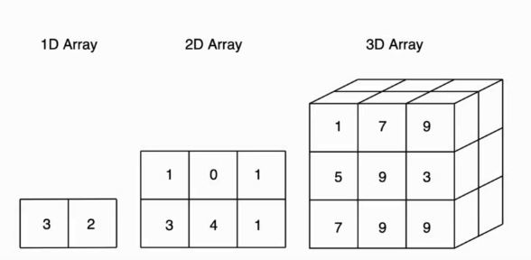
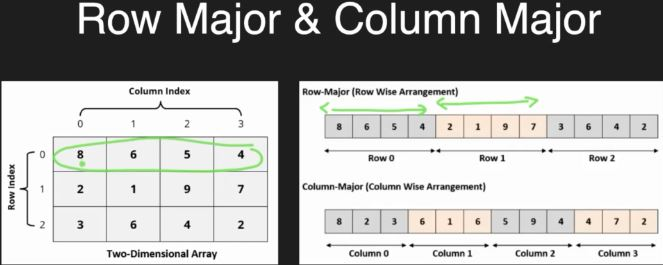
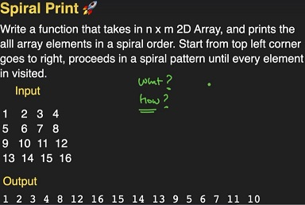
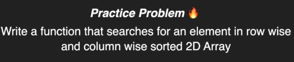

# 2-D ARRAYS

## INTRODUCTION



### HOW ARE THEY STORED?

In memeory everything must be linearised.

Two common ways of storing the arrays is :-
1) Row Major Form
2) Column Major Form



* In 2d arrays passing number of rows is optional but we must pass number of coloumns and it should be fixed. 

* Always passed by refrence.

```C++
#include<iostream>
using namespace std;

void print(int arr[][100],int n,int m){
    //output
    for(int i=0;i<n;i++){
        for(int j=0;j<m;j++){
            cout<<arr[i][j]<<" ";
        }
        cout<<endl;
    }
}

int main()
{
    //constraints
    int arr[100][100];
    //n rows m coloumns
    int n,m;
    cin>>n>>m;
    //take input
    for(int i=0;i<n;i++){
        for (int j=0;j<m;j++){
            cin>>arr[i][j];
        }
    }
    print(arr,n,m);
    return 0;
}
```

## SPIRAL PRINT PROBLEM



```C++
#include<iostream>
using namespace std;

void print(int arr[][4],int n,int m){
    //4 variables
    int startrow = 0;
    int endrow = n - 1;
    int startcol = 0;
    int endcol = m - 1;
    //outer loop (traverse outer boundary)
    while(startcol<=endcol && startrow<=endrow){
        //start row
        for (int col = startcol;col<=endcol;col++){
            cout<<arr[startrow][col]<<" ";
        }
        //end col
        for(int row=startrow+1;row<=endrow;row++){
            cout<<arr[row][endcol]<<" ";
        }
        //end row
        for(int col=endcol-1;col>=startcol;col--){
            //avoid duplicate printing
            if(startrow==endrow){
                break;
            }
            cout<<arr[endrow][col]<<" ";
        }
        //start col
        for(int row = endrow-1; row>=startrow+1;row--){
            //avoid duplicate printing
            if(startcol==endcol){
                break;
            }
            cout<<arr[row][startcol]<<" ";
        }
        //update variables to point the inner spiral
        startrow++;
        startcol++;
        endrow--;
        endcol--;
    }
}

int main()
{
    //print in spiral form
    int arr[][4] = {{1,2,3,4},{12,13,14,5},{11,16,15,6},{10,9,8,7}};
    int n = 4,m = 4;
    print(arr,n,m);
    return 0;
}
```

## SEARCHING IN A SORTED 2-D ARRAY



There are multiple techniques to searck over a 2-d array like:-

1) *Brute force method(Linear search)*: In this we iterate over entire array to search an element and its time complexity = O[n*m].
2) *Binary search*: Its time complexity = O[n*logm].
3) *Staircase search*: In this method we pickup a corner element and than iterate in a such a way that we reach our key element and as this path which we take form a stair pattern so it is called as **staircase** method, its time complexity = O[n+m].

```C++
#include<iostream>
using namespace std;

pair<int,int> staircase_search(int arr[][4],int n,int m,int key){
    //if key is not present in the array
    if(key < arr[0][0] || key > arr[n-1][m-1]){
        return {-1,-1};
    }
    //stair_case method
    int i = 0;
    int j = m-1;
    while(i<n && j>=0){
        if(arr[i][j]==key){
            return {i,j};
        }
        else if(arr[i][j]>key){
            j--;
        }
        else{
            i++;
        }
    }
    return {-1,-1};
}

int main()
{
    int arr[][4] = {{10, 20, 30, 40},
                    {15, 25, 35, 45},
                    {27, 28, 37, 48},
                    {32, 33, 35, 50}};
    int n = 4, m = 4, key = 33;
    pair<int,int> p = staircase_search(arr,n,m,key);
    cout<<"("<<p.first<<","<<p.second<<")"<<endl;
    return 0;
}
```

## MANGO TREES

