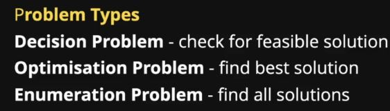

# BACKTRACKING

* It is a *algorithmic technique*.
* In which we recursively try to build a solution.
* By searching the entire search space to solve a computation problem.



## BACKTRACKING ON ARRAY CODE

```C++
#include<iostream>
using namespace std;

void print(int arr[],int n){
    for(int i=0;i<n;i++){
        cout<<arr[i]<<" ";
    }
    cout<<endl;
}

void fillarray(int arr[],int i,int n,int val){
    //base case
    if(i==n){
        //print our array
        print(arr,n);
        return;
    }
    //rec case
    arr[i] = val;
    fillarray(arr,i+1,n,val+1);
    //backtracking step
    arr[i] = -1*arr[i];
    return;
}

int main()
{
    int arr[100] = {0};
    int n;
    cin>>n;
    fillarray(arr,0,n,1);
    //array is changed because of backtracking step
    print(arr,n);
    return 0;
}
```

## EXAMPLE-1(Finding subsets)

```C++
#include<iostream>
using namespace std;

void findsubsets(char *input,char *output,int i,int j){
    //base case
    if(input[i]=='\0'){
        output[j] = '\0';
        if(output[0] == '\0'){
            cout<<"NULL"<<endl;
        }
        cout<<output<<endl;
        return;
    }
    //rec case
    //include the ith letter
    output[j] = input[i];
    findsubsets(input,output,i+1,j+1);
    //exclude the ith letter
    //overwriting
    findsubsets(input,output,i+1,j);
    return;
}

int main()
{
    char input[100];
    char output[100];
    cin>>input;
    findsubsets(input,output,0,0);
    return 0;
}
```

## EXAMPLE-2(Ordreing subsets)

```C++
#include<iostream>
#include<vector>
#include<algorithm>
#include<string>
using namespace std;

bool compareto(string a,string b){
    if(a.length()==b.length()){
        return a<b;//lexicographic order
    }
    return a.length()<b.length();
}

void findsubsets(char *input,char *output,int i,int j,vector<string> &list){
    //base case
    if(input[i]=='\0'){
        output[j] = '\0';
        string temp(output);
        list.push_back(temp);
        return;
    }
    //rec case
    //include the ith letter
    output[j] = input[i];
    findsubsets(input,output,i+1,j+1,list);
    //exclude the ith letter
    //overwriting
    findsubsets(input,output,i+1,j,list);
    return;
}

int main()
{
    char input[100];
    char output[100];
    vector<string> list;
    cin>>input;
    findsubsets(input,output,0,0,list);
    sort(list.begin(),list.end(),compareto);
    //print
    for(auto s : list){
        cout<<s<<" ";
    }
    return 0;
}
```

## EXAMPLE-3(Permutations)

```C++
   if(i==s.length()){
        cout<<s<<endl;
        return ;
    }
 
 
    //recursive case
    for(int j=i;j<s.length();j++){
        swap(s[i],s[j]);
        permutation(s,i+1);
        swap(s[i],s[j]);
    }
    return ;
}
```

## EXAMPLE-5(N-Queen)


```C++
#include<iostream>
using namespace std;

bool canplace(int board[][20],int n,int x,int y){
    //coloumn
    for(int k=0;k<x;k++){
        if(board[k][y]==1){
            return false;
        }
    }
    //left diag
    int i = x;
    int j = y;
    while(i>=0 && j>=0){
        if(board[i][j]==1){
            return false;
        }
        i--;
        j--;
    }
    //right diag
    i = x;
    j = y;
    while(i>=0 && j<n){
        if(board[i][j]==1){
            return false;
        }
        i--;
        j++;
    }
    return true;
}

void printboard(int n, int board[][20]){
    for(int i=0;i<n;i++){
        for(int j=0;j<n;j++){
            cout<<board[i][j]<<" ";
        }
        cout<<endl;
    }
    cout<<endl;
}

bool solvequeen(int n,int board[][20],int i){
    //base case
    if(i==n){
        //print board
        printboard(n,board);
        return true;
    }
    //rec case
    //try to place every queen in a row
    for(int j=0;j<n;j++){
        //whether the current i,j is safe or not
        if(canplace(board,n,i,j)){
            board[i][j] = 1;
            bool success = solvequeen(n,board,i+1);
            if(success){
                return true;
            }
            //backtracking step
            board[i][j] = 0;
        }
    }
    return false;
}

int main()
{
    int board[20][20] = {0};
    int n;
    cin>>n;
    solvequeen(n,board,0);
    return 0;
}
```

## EXAMPLE-6(N-Queen all ways)

* Time complexity = O[n^n];

```C++
#include<iostream>
using namespace std;

bool canplace(int board[][20],int n,int x,int y){
    //coloumn
    for(int k=0;k<x;k++){
        if(board[k][y]==1){
            return false;
        }
    }
    //left diag
    int i = x;
    int j = y;
    while(i>=0 && j>=0){
        if(board[i][j]==1){
            return false;
        }
        i--;
        j--;
    }
    //right diag
    i = x;
    j = y;
    while(i>=0 && j<n){
        if(board[i][j]==1){
            return false;
        }
        i--;
        j++;
    }
    return true;
}

int solvequeen(int n,int board[][20],int i){
    //base case
    if(i==n){
        //print board
        //printboard(n,board);
        return 1;
    }
    //rec case
    //try to place every queen in a row
    int ways = 0;
    for(int j=0;j<n;j++){
        //whether the current i,j is safe or not
        if(canplace(board,n,i,j)){
            board[i][j] = 1;
            ways += solvequeen(n,board,i+1);
            //backtracking step
            board[i][j] = 0;
        }
    }
    return ways;
}

int main()
{
    int board[20][20] = {0};
    int n;
    cin>>n;
    cout<<"ways = "<<solvequeen(n,board,0)<<endl;
    return 0;
}
```

## EXAMPLE-7(Grid ways)


* Time complexity = O[2^(m+n)].

```C++
#include<iostream>
using namespace std;

int gridways(int i,int j,int m,int n){
    if(i==m && j==n){
        return 1;
    }
    if(i>=(m+1) || j>=(n+1)){
        return 0;
    }
    int ans = gridways(i+1,j,m,n) + gridways(i,j+1,m,n);
    return ans;
}

int main()
{
    int m,n;
    cin>>m>>n;
    cout<<gridways(0,0,m-1,n-1)<<endl;
    return 0;
}
```

### MATHS TRICK

We can solve the grid problem using p and c by applying the formula:-

> (m+n-2)!/((m-1)!*(n-1)!)


## EXAMPLE-8(Sudoku code)**

```C++
#include<iostream>
using namespace std;

bool issafe(int mat[][9],int i,int j,int no,int n){
    //check for row and col
    for(int k=0;k<9;k++){
        if(mat[k][j]==no || mat[i][k]==no){
            return false;
        }
    }
    //check for subgrid
    int sx = (i/3)*3;
    int sy  = (j/3)*3;
    for(int x=sx;x<sx+3;x++){
        for(int y=sy;y<sy+3;y++){
            if(mat[x][y]==no){
                return false;
            }
        }
    }
    return true;
}

bool solveSudoku(int mat[][9],int i,int j,int n){
    //base case
    if(i==n){
        //print solution
        for(int i=0;i<9;i++){
            for(int j=0;j<9;j++){
                cout<<mat[i][j]<<" ";
            }
            cout<<endl;
        }
        return true;
    }
    //rec case
    if(j==n){
        return solveSudoku(mat,i+1,0,n);
    }
    //skip prefilled cell
    if(mat[i][j]!=0){
        return solveSudoku(mat,i,j+1,n);
    }
    //cell to be filled
    for(int no=1;no<=n;no++){
        if(issafe(mat,i,j,no,n)){
            mat[i][j] = no;
            bool solvesubproblem = solveSudoku(mat,i,j+1,n);
            if(solvesubproblem==true){
                return true;
            }
        }
    }
    //if no option works
    //backtracking step
    mat[i][j] = 0;
    return false;
}

int main()
{
    int n = 9;
    int mat[9][9] = 
        {{5,3,0,0,7,0,0,0,0},
        {6,0,0,1,9,5,0,0,0},
        {0,9,8,0,0,0,0,6,0},
        {8,0,0,0,6,0,0,0,3},
        {4,0,0,8,0,3,0,0,1},
        {7,0,0,0,2,0,0,0,6},
        {0,6,0,0,0,0,2,8,0},
        {0,0,0,4,1,9,0,0,5},
        {0,0,0,0,8,0,0,7,9}};

    if(!solveSudoku(mat,0,0,n)){
        cout<<"No solution exists!"<<endl;
    }
    return 0;
} 
```