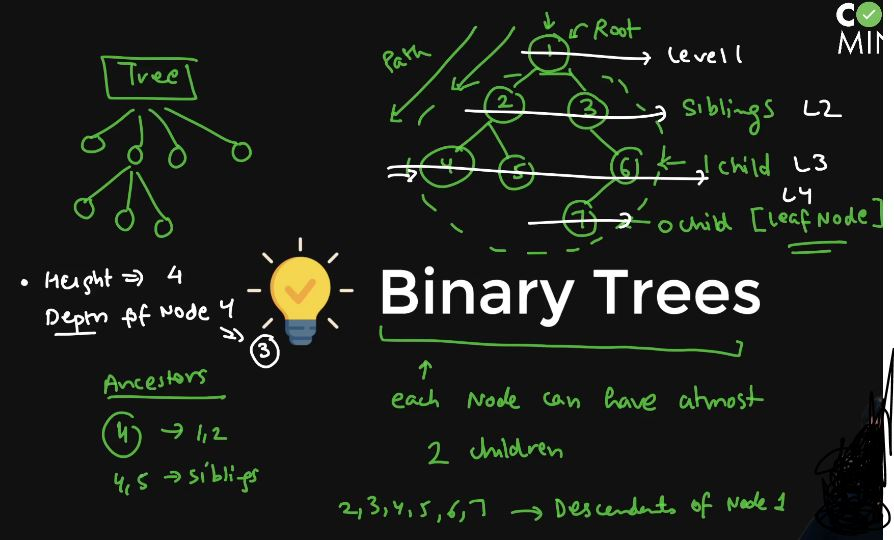
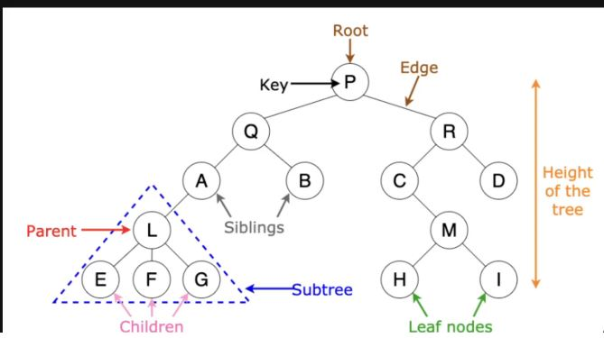
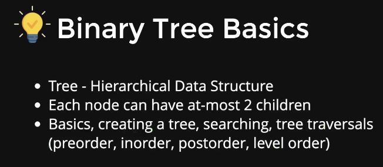
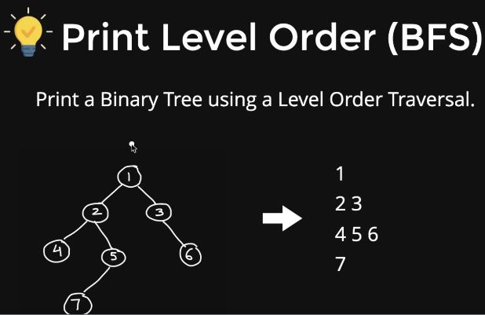
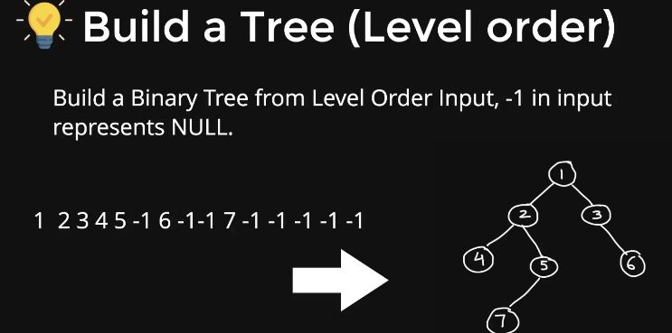

# BINARY TREES

* Starting node is called as **ROOT NODE**.
* And under it we have **SIBLING NODE**.
* And the node having no child further is called as **LEAF NODE**.








## BUILD TREE PREORDER

```C++
#include<iostream>
using namespace std;
//INPUT: 1 2 4 -1 -1 5 7 -1 -1 -1 3 -1 6 -1 -1
//OUTPUT: 1 2 4 5 7 3 6 
class Node{
    public:
        int data;
        Node* left;
        Node* right;
        Node(int d){
            data = d;
            left = right = NULL;
        }
};
//Preorder buil of the tree
Node* BuildTree(){
    int d;
    cin>>d;
    if(d==-1){
        return NULL;
    }
    Node* n = new Node(d);
    n->left = BuildTree();
    n->right = BuildTree();
    return n;
}
```

### PREORDER TRAVERSAL

```C++
void printPreorder(Node* root){
    if(root==NULL){
        return;
    }
    cout<<root->data<<" ";
    printPreorder(root->left);
    printPreorder(root->right);
}

int main()
{
    Node* root = BuildTree();
    printPreorder(root);
    return 0;
}
```

## INORDER TRAVERSAL

```C++
#include<iostream>
using namespace std;
//INPUT: 1 2 4 -1 -1 5 7 -1 -1 -1 3 -1 6 -1 -1
//OUTPUT: 4 2 7 5 1 3 6
void printInorder(Node* root){
    if(root==NULL){
        return;
    }
    printInorder(root->left);
    cout<<root->data<<" ";
    printInorder(root->right);
}

int main()
{
    Node* root = BuildTree();
    printInorder(root);
    cout<<endl;
    return 0;
}
```

### POSTORDER TRAVERSAL

```C++
#include<iostream>
using namespace std;
//INPUT: 1 2 4 -1 -1 5 7 -1 -1 -1 3 -1 6 -1 -1
//OUTPUT: 4 7 5 2 6 3 1
void printPostorder(Node* root){
    if(root==NULL){
        return;
    }
    printPostorder(root->left);
    printPostorder(root->right);
    cout<<root->data<<" ";
}
int main()
{
    Node* root = BuildTree;
    printPostorder(root);
    cout<<endl;
    return 0;
}
```

### LEVEL ORDER PRINT



```C++
#include<iostream>
#include<queue>
using namespace std;
//INPUT: 1 2 4 -1 -1 5 7 -1 -1 -1 3 -1 6 -1 -1
//OUTPUT: 4 7 5 2 6 3 1
void levelOrderPrint(Node* root){
    queue<node*> q;
    q.push(root);
    q.push(NULL);
    while(!q.empty()){
        node* temp = q.front();
        if(temp==NULL){
            cout<<endl;
            q.pop();if(!q.empty()){
                q.push(NULL);
            }
        }
        else{
            q.pop();
            cout<<temp->data<<" ";
            if(temp->left){
                q.push(temp->left);
            }
            if(temp->right){
                q.push(temp->right);
            }
        }
    }
    return;
}
int main()
{
    Node* root = BuildTree();
    levelOrderPrint(root);
    cout<<endl;
    return 0;
}
```

### BUILD A TREE LEVEL ORDER



```C++
#include<iostream>
using namespace std;
//INPUT: 1 2 3 4 5 -1 6 -1 -1 7 -1 -1 -1 -1 -1
Node* levelOrderBuild(){
    int d;
    cin>>d;
    Node* root = new node(d);
    queue<Node*> q;
    q.push(root);
    while(!q.empty()){
        Node* current = q.front();
        q.pop();
        int c1, c2;
        cin>>c1>>c2;
        if(c1!=-1){
            current->left = new Node(c1);
            q.push(current->left);
        }
        if(c2!=-1){
            current->right = new Node(c2);
            q.push(current->right);
        }
    }
    return root;
}
int main()
{
    Node* root = levelOrderBuild();
    levelOrderPrint(root);
    cout<<endl;
    return 0;
}
```

### HEIGHT OF TREE

* Time complexity = O[n].

```C++
#include<iostream>
using namespace std;

int height(Node* root){
    if(root==NULL){
        return 0;
    }
    int h1 = height(root->left);
    int h2 = height(root->right);
    return 1 + max(h1,h2);
}

int main()
{
    Node* root = BuildTree();
    height(root);
    cout<<endl;
    return 0;
}
```

### DIAMETER OF TREE - I

* Time complexity = O[n^2].

```C++
#include<iostream>
using namespace std;

int height(Node* root){
    if(root==NULL){
        return 0;
    }
    int h1 = height(root->left);
    int h2 = height(root->right);
    return 1 + max(h1,h2);
}
//diameter
int diameter(Node* root){
    //base case
    if(root==NULL){
        return 0;
    }
    //rec case
    int D1 = height(root->left) + height(root->right);
    int D2 = diameter(root->left);
    int D2 = diameter(root->right);
    return max(D1,max(D2,D3)); 
}

int main()
{
    Node* root = BuildTree();
    cout<<diameter(root)<<endl;
    return 0;
}
```

### DIAMETER OF TREE - II

* Time complexity = O[n].

```C++
#include<iostream>
using namespace std;

class HDpair{
    public:
        int height;
        int diameter;
};

HDpair optDiameter(Node* root){
    HDpair p;
    if(rooot==NULL){
        p.height = p.diameter = 0;
    }
    //otherwise
    HDpair Left = optDiameter(root->left);
    HDpair Right = optDiameter(root->right);
    p.height = max(Left.height,Right.height);

    int D1 = Left.height + Right.height;
    int D2 = Left.diameter;
    int D3 = Right.diameter;
    p.diameter = max(D1,max(D2,D3));
    return p;
}

int main()
{
    cout<<"Opt Diameter is: "<<optDiameter(root).diameter<<endl;
    return 0;
}
```