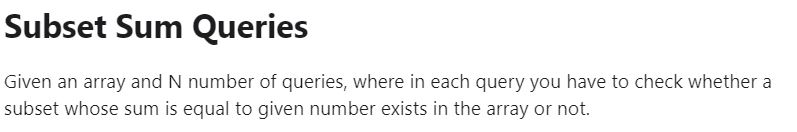
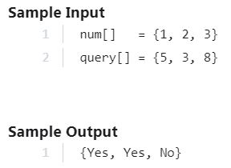

# BIT MANIPULATION


## BITWISE OPERATORS

### BINARY AND &

* RULES:-
1) 0 & 0 = 0
2) 1 & 0 = 0
3) 0 & 1 = 0
4) 1 & 1 = 1

* EXAMPLE:-
1) 5 & 7 = 5

NUMBER  |  BINARARY_CODE
--------|----------------
5       |  0000101
7       |  0000111
NET = 5 |  0000101

### BINARY OR |

* RULES:-
1) 0 | 0 = 0
2) 0 | 1 = 1
3) 1 | 0 = 1
4) 1 | 1 = 1

* EXAMPLE:-
1) 5 | 8 = 13

NUMBER   |  BINARARY_CODE
---------|----------------
5        |  0101
8        |  1000
NET = 13 |  1101 

### BINARY XOR ^

* RULES:-
1) 0 ^ 0 = 0
2) 0 ^ 1 = 1
3) 1 ^ 0 = 1
4) 1 ^ 1 = 0

* EXAMPLE:-
1) 5 ^ 7 = 2

NUMBER  |  BINARARY_CODE
--------|----------------
5       |  0000101
7       |  0000111
NET = 2 |  0000010 

### BINARY NOT ~

* RULES:-
1) ~0(bit) = 1
2) ~1 = 0
3) ~0(int) = -1

* EXAMPLE:-
1) ~5 = 10

NUMBER   |  BINARARY_CODE
---------|----------------
5        |  0101
~5       |  1010
NET = -2 |   

* MSB(MOST SIGNIFICANT BIT)

* RULES:-
1) 1 = -ve
2) 0 = +ve

* EXAMPLE:-
1) 1110 = As first digit is 1, so -ve so binary code is 110 then number is (-5).
2) 0110 = As first digit is 0, so +ve so binary code is 110 then number is (+5).

### BINARY LEFT_SHIFT <<

* RULE:-
1) x << y = We remove the first y bits from x and move all left bits to leftside by y bits and then put y zeros at the right side of the binary_code.

* EXAMPLE:-

General Code:-

1) x << y = (2^y)*x

NUMBER        |  BINARARY_CODE
--------------|----------------
x             |  0000101
Remove y bits |  0010100
NET = (2^y)*x | 

2) 5 << 2 = 20

NUMBER        |  BINARARY_CODE
--------------|----------------
5             |  0000101
Remove 2 bits |  0010100
NET = (2^2)*5 |   

### BINARY RIGHT_SHIFT <<

* RULE:-
1) x >> y = We remove the last y bits from x and move all left bits to rightside by y bits and then put y zeros at the leftside of the binary_code.

* EXAMPLE:-

General Code:-

1) x >> y = x/(2^y)

NUMBER        |  BINARARY_CODE
--------------|----------------
x             |  0000101
Remove y bits |  0010100
NET = x/(2^y) | 

2) 5 >> 2 = 1

NUMBER        |  BINARARY_CODE
--------------|----------------
5             |  0000101
Remove 2 bits |  0010100
NET = 5/(2^2) |   

## ODD - EVEN

* RULES:-
1) Last bit is 1 = ODD
2) Last bit is 0 = EVEN

* EXAMPLES:-

BINARY_CODE    |   ODD_EVEN
---------------|------------
0000101        |   ODD
0000100        |   EVEN

```C++
#include<iostream>
using namespace std;
int main()
{
    int x;
    cin>>x;
    if(x&1){
        cout<<"ODD"<<endl;
    }
    else{
        cout<<"EVEN"<<endl;
    }
    return 0;
}
```
## ith BIT MANIPULATION

### GET ith BIT

```C++
#include<iostream>
using namespace std;

int getithbit(int n,int i){
    int mask = (1<<i);
    return (n&mask) > 0 ? 1 : 0;
}

int main()
{
    int n=5;
    int i;
    cin>>i;
    cout<<getithbit(n,i)<<endl;
    return 0;
}
```

### SET ith BIT

```C++
#include<iostream>
using namespace std;

void setithbit(int &n,int i){
    int mask = (1<<i);
    n = (n|mask);

}

int main()
{
    int n=5;
    int i;
    cin>>i;
    setithbit(n,i)<<endl;
    cout<<n;
    return 0;
}
```

### CLEAR ith BIT

```C++
#include<iostream>
using namespace std;

void clearithbit(int &n,int i){
    int mask = ~(1<<i);
    n = (n&mask);

}

int main()
{
    int n=5;
    int i;
    cin>>i;
    clearithbit(n,i)<<endl;
    cout<<n;
    return 0;
}
```

### UPDATE ith BIT

```C++
#include<iostream>
using namespace std;

void clearithbit(int &n,int i){
    int mask = ~(1<<i);
    n = (n&mask);
}

void updateithbit(int &n,int i,int v){
    clearithbit(n,i);
    int mask = (v<<i);
    n = (n|mask);
}

int main()
{
    int n=5;
    int i;
    cin>>i;
    int v = 1;
    updateithbit(n,i,v)<<endl;
    cout<<n<<endl;
    return 0;
}
```

### CLEAR LAST i BITS

```C++
#include<iostream>
using namespace std;

void clearlastibits(int &n,int i){
    int mask = ((~0)<<i);
    n = (n&mask);
}

int main()
{
    int n=15;
    int i;
    cin>>i;
    clearlastibits(n,i);
    cout<<n<<endl;
    return 0;
}
```

### CLEAR RANGE OF BITS

```C++
#include<iostream>
using namespace std;

void clearrangeofbits(int &n,int i,int j){
    int a = ((~0)<<j+1);
    int b = (1<<i)-1;
    int mask = a|b;
    n = (n&mask);
}

int main()
{
    int n=15;
    int i,j;
    cin>>i>>j;
    clearrangeofbits(n,i,j);
    cout<<n<<endl;
    return 0;
}
```

### REPLACE BITS

```C++
#include<iostream>
using namespace std;

void clearrangeofbits(int &n,int i,int j){
    int a = ((~0)<<j+1);
    int b = (1<<i)-1;
    int mask = a|b;
    n = (n&mask);
}

void replacebits(int &n,int i,int j,int m){
    clearrangeofbits(n,i,j);
    int mask = (m<<i);
    n = n|mask;
}

int main()
{
    int n = 15;
    int i = 1;
    int j = 3;
    int m = 2;
    replacebits(n,i,j,m);
    cout<<n<<endl;
    return 0;
}
```

### TWO POWER

```C++
#include<iostream>
using namespace std;

int main()
{
    int n;
    cin>>n;
    if((n&(n-1))==0){
        cout<<"Power of 2"<<endl;
    }
    else{
        cout<<"Not a power of 2"<<endl;
    }
    return 0;
}
```

### COUNT SET BITS

Time complexity = O[log(n)].

```C++
#include<iostream>
using namespace std;

int count_bits(int n){
    int count = 0;
    while(n>0){
        int last_bit = (n&1);
        count += last_bit;
        n = n>>1;
    }
    return count;
}
// better in terms of time complexity
int count_bits_hack(int n){
    int ans = 0;
    while(n>0){
        n = n & (n-1);
        ans++;
    }
    return ans;
}

int main()
{
    int n;
    cin>>n;
    cout<<"Number of set bits are: "<<count_bits(n)<<endl;
    cout<<"Number of set bits are: "<<count_bits(n)<<endl;
    return 0;
}
```

### FAST EXPONENTIATION a^n

Time complexity = O[log(n)].

```C++
#include<iostream>
using namespace std;

int fastexpo(int a,int n){
    int ans = 1;
    while(n>0){
        int last_bit = (n&1);
        if(last_bit){
            ans *= a;
        }
        a = a*a;
        n = n>>1;
    }
    return ans;
}

int main()
{
    int a = 3;
    int n = 5;
    cout<<fastexpo(a,n)<<endl;
    return 0;
}
```

### MAKE IT BINARY!

```C++
#include<iostream>
using namespace std;

int converttobinary(int n){
    int ans = 0;
    int p = 1;
    while(n>0){
        int last_bit = (n&1);
        ans += p*last_bit;
        p = p*10;
        n = n>>1;
    }
    return ans;
}

int main()
{
    int n = 31;
    cout<<converttobinary(n)<<endl;
    return 0;
}
```

## VERY IMP PROBLEM





```C++
// C++ program to answer subset sum queries using bitset
#include <bits/stdc++.h>
using namespace std;
  
// Maximum allowed query value
# define MAXSUM 10000
  
// function to check whether a subset sum equal to n
// exists in the array or not.
void processQueries(int query[], int nq, bitset<MAXSUM> bit)
{
    // One by one process subset sum queries
    for (int i=0; i<nq; i++)
    {
       int x = query[i];
  
       // If x is beyond size of bit[]
       if (x >= MAXSUM)
       {
           cout << "NA, ";
           continue;
       }
  
       // Else if x is a subset sum, then x'th bit
       // must be set
       bit[x]? cout << "Yes, " : cout << "No, ";
    }
}
  
// function to store all the subset sums in bit vector
void preprocess(bitset<MAXSUM> &bit, int arr[], int n)
{
    // set all the bits to 0
    bit.reset();
  
    // set the 0th bit because subset sum of 0 exists
    bit[0] = 1;
  
    // Process all array elements one by one
    for (int i = 0; i < n; ++i)
  
        // Do OR of following two
        // 1) All previous sums. We keep previous value
        //    of bit.
        // 2) arr[i] added to every previous sum. We
        //    move all previous indexes arr[i] ahead.
        bit |= (bit << arr[i]);
}
  
// Driver program
int main()
{
    int arr[] = {3, 1, 5};
    int query[] = {8, 7};
  
    int n  = sizeof(arr) / sizeof(arr[0]);
    int nq = sizeof(query) / sizeof(query[0]);
  
    // a vector of MAXSUM number of bits
    bitset<MAXSUM> bit;
  
    preprocess(bit, arr, n);
    processQueries(query, nq,  bit);
  
    return 0;
}
```

> [Video Explaination](https://www.youtube.com/watch?v=PCitGsjzUc8)
