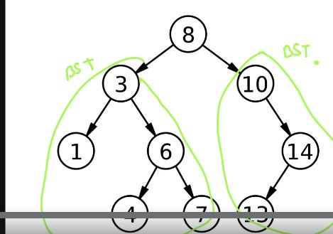
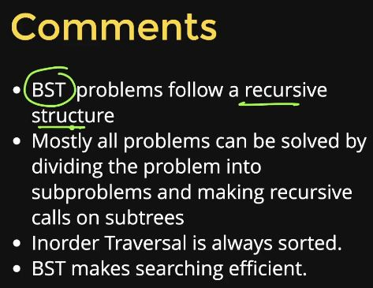

# BINARY SEARCH TREE



* It's a binary tree.
* Left and right part must also be a BST.
* Left part must contain values which are less than equal to root node value.
* Right part must contain values which are more than root node value.
* Inorder traversal of the BST is sorted.
* Binary tree has time complexity for search of O[n], while time complexity for BST is O[Height of the tree].



## BST CREATION

```C++
#include<iostream>
using namespace std;

class Node{
    public:
        int key;
        Node* left;
        Node* right;
        Node(int key){
            this->key = key;
            left = right = NULL;
        }
};

Node* insert(Node* root,int a){
    //base case
    if(root = NULL){
        return new Node(a);
    }
    //rec case
    if(a<root->key){
        root->left = insert(root->left,a);
    }
    else{
        root->right = insert(root->right,a);
    }
    return root;
}

void printInorder(Node* root){
    if(root==NULL){
        return;
    }
    //left,root,right
    printInorder(root->left);
    cout<<root->key<<" ";
    printInorder(root->right);
}

int main()
{
    Node* root = NULL;
    int arr[] = {8,3,10,1,6,14,4,7,13};
    for(int x : arr){
        root = insert(root,x);
    }
    printInorder(root);
    return 0;
}
```

## SEARCHING IN BST

* Time complexity = O[H].

```C++
bool search(Node* root,int key){
    if(root==NULL){
        return false;
    }
    if(root->key==key){
        return true;
    }
    if(key<root->key){
        return search(root->left,key);
    }
    return search(root->right,key);
}

int main(){
    Node* root = NULL;
    int arr[] = {8,3,10,1,6,14,4,7,13};
    for(int x : arr){
        root = insert(root,x);
    }
    int key;
    cin>>key;
    cout<<search(root,key);
    return 0;
}
```

## DELETION IN BST

```C++
#include<iostream>
using namespace std;

class Node{
    public:
        int key;
        Node* left;
        Node* right;
        Node(int key){
            this->key = key;
            left = right = NULL;
        }
};

Node* insert(Node* root,int a){
    //base case
    if(root = NULL){
        return new Node(a);
    }
    //rec case
    if(a<root->key){
        root->left = insert(root->left,a);
    }
    else{
        root->right = insert(root->right,a);
    }
    return root;
}

void printInorder(Node* root){
    if(root==NULL){
        return;
    }
    //left,root,right
    printInorder(root->left);
    cout<<root->key<<" ";
    printInorder(root->right);
}

Node* findmin(Node* root){
    while (root->left!=NULL)
    {
        root = root->left;
    }
    return root;
}

Node* remove(Node* root,int key){
    if(root==NULL){
        return NULL;
    }
    else if(key<root->key){
        root->left = remove(root->left,key);
    }
    else if(key>root->key){
        root->right = remove(root->right,key);
    }
    else{
        //when node matches with key
        //1->No child
        if(root->left==NULL && root->right==NULL){
            delete root;
            root = NULL;
        }
        //2->Single child
        else if(root->left==NULL){
            Node* temp = root;
            root = root->right;
            delete temp;
        }
        else if(root->right==NULL){
            Node* temp = root;
            root = root->left;
            delete temp;
        }
        //3->2 children
        else{
            Node* temp = findmin(root->right);
            root->key = temp->key;
            root->right = remove(root->right,temp->key);
        }
    }
    return root;
}

int main()
{
    Node* root = NULL;
    int arr[] = {8,3,10,1,6,14,4,7,13};
    for(int x : arr){
        root = insert(root,x);
    }
    printInorder(root);
    int key;
    cin>>key;
    root = remove(root,key);
    printInorder(root);
    return 0;
}
```

## PRINT RANGE

```C++
#include<iostream>
using namespace std;

class Node{
    public:
        int key;
        Node* left;
        Node* right;
        Node(int key){
            this->key = key;
            left = right = NULL;
        }
};

Node* insert(Node* root,int a){
    //base case
    if(root = NULL){
        return new Node(a);
    }
    //rec case
    if(a<root->key){
        root->left = insert(root->left,a);
    }
    else{
        root->right = insert(root->right,a);
    }
    return root;
}

void printInorder(Node* root){
    if(root==NULL){
        return;
    }
    //left,root,right
    printInorder(root->left);
    cout<<root->key<<" ";
    printInorder(root->right);
}

void printRange(Node* root, int k1,int k2){
    if(root==NULL){
        return;
    }
    if(root->key>=k1 && root->key<=k2){
        printRange(root->left,k1,k2);
        cout<<root->key<<" ";
        printRange(root->right,k1,k2);
    }
    else if(root->key>k2){
        printRange(root->left,k1,k2);
    }
    else{
        //root->key<k1
        printRange(root->right,k1,k2);
    }
}

int main()
{
    Node* root = NULL;
    int arr[] = {8,3,10,1,6,14,4,7,13};
    for(int x : arr){
        root = insert(root,x);
    }
    //printInorder(root);
    printRange(root,5,12);
    cout<<endl;
    return 0;
}
```

## ROOT TO LEAF PATH

```C++
#include<iostream>
#include<vector>
using namespace std;
//INPUT: 1 2 4 -1 -1 5 7 -1 -1 -1 3 -1 6 -1 -1
//OUTPUT: 4 2 7 5 1 3 6
void printInorder(Node* root){
    if(root==NULL){
        return;
    }
    printInorder(root->left);
    cout<<root->data<<" ";
    printInorder(root->right);
}

void printRoot2leafpaths(Node* root,vector<int> &path){
    if(root==NULL){
        return;
    }
    if(root->left==NULL && root->right==NULL){
        for(int node : path){
            cout<<node<<"->";
        }
        cout<<root->data<<" ";
        cout<<endl;
        return;
    }
    //rec case
    path.push_back(root->data);
    printRoot2leafpaths(root->left,path);
    printRoot2leafpaths(root->right,path)
    //backtracking
    path.pop_back();
    return;
}

int main()
{
    Node* root = BuildTree();
    vector<int> path;
    printInorder(root);
    printRoot2leafpaths(root,path);
    cout<<endl;
    return 0;
}
```