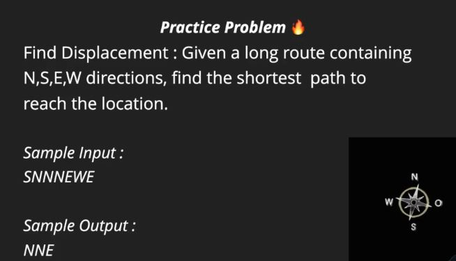

# CHARACTER ARRAYS

## INTRODUCION

```C++
/* char a[100];
char a[100] = {'a','b','c'}; a garbage value will be also displayed
char a[100] = {'a','b','c','/0'};
char a[100] = "abc"; */

#include<iostream>
#include<cstring>
using namespace std;
int main()
{
    char a[] = {'a','b','c','d','e','f','\0'};
    cout<<a<<endl;
    cout<<strlen(a)<<endl;//number of visible char
    cout<<sizeof(a)<<endl;//num of all char
    char b[100];
    cin>>b;//take space as end of array
    cout<<b<<endl;
    return 0;
```

## USING CIN.GET()

```C++
#include<iostream>
#include<cstring>
using namespace std;
int main()
{
    char sentence[100];
    char temp = cin.get();
    int len = 0;
    /* while(temp!='\n'){
        len++;
        cout<<temp;
        //update value of temp
        temp = cin.get();
    } */
    while(temp!='#'){
        sentence[len++] = temp;
        //update the value in temp
        temp = cin.get();
    }
    sentence[len] = '\0';
    cout<<endl;
    cout<<sentence<<endl;
    cout<<"length"<<len+1<<endl;
    return 0;
}
```

## COUNTING CHARACTERS

```C++
#include<iostream>
#include<cstring>
using namespace std;
int main()
{
    char ch;
    ch = cin.get();
    //count
    int alpha = 0;
    int space = 0;
    int digit = 0;
    while(ch!='\n'){
        if(ch>='0' && ch<='9'){
            digit++;
        }
        else if((ch>='a' && ch<='z') || (ch>='A' && ch<='Z')){
            alpha++;
        }
        else if(ch==' ' || ch=='\t'){
            space++;
        }
        ch = cin.get();
    }
    cout<<"Total alphabets are: "<<alpha<<endl;
    cout<<"Total digits are: "<<digit<<endl;
    cout<<"Total spaces are: "<<space<<endl;
    return 0;
}
```

## USING CIN.GETLINE()

```C++
#include<iostream>
#include<cstring>
using namespace std;
int main()
{
    /* char sentence[1000];
    cin.getline(sentence,1000); */
    char paragraph[1000];
    cin.getline(paragraph,1000,'.');
    cout<<paragraph<<endl;
    return 0;
}
```

## SHORTEST PATH



```C++
#include<iostream>
#include<cmath>
using namespace std;
int main()
{
    char route[1000];
    cin>>route;
    int x = 0;
    int y = 0;
    for(int i=0;route[i]!='\0';i++){
        switch(route[i]){
            case 'N': y++;
            break;
            case 'S': y--;
            break;
            case 'E': x++;
            break;
            case 'W': x--;
            break;
        }
    }
    int disp = x*x + y*y;
    cout<<"Displacement is: "<<sqrt(disp)<<endl;
    return 0;
}
```

## STRING COPY, COMPARE, CONCAT

```C++
#include<iostream>
#include<cstring>
using namespace std;
int main()
{
    char a[1000] = "apple";
    char b[1000];
    char c[1000] = "lol";
    //length
    cout<<strlen(a)<<endl;
    //copy
    strcpy(b,a);
    cout<<b<<endl;
    //compare
    cout<<strcmp(a,b)<<endl;
    //catenation
    cout<<strcat(c,b)<<endl;
    return 0;
}
```

## LARGEST STRING

```C++
#include<iostream>
#include<cstring>
using namespace std;
int main()
{
    int n;
    cin>>n;
    cin.get();
    char sentence[1000];
    char largest[1000];
    int largest_len = 0;
    while(n>0){
        cin.getline(sentence,1000);
        int len = strlen(sentence);
        if(len > largest_len){
            largest_len = len;
            strcpy(largest,sentence);
        }
    }
    cout<<"Largest sentence is: "<<largest<<endl;
    return 0;
}
```

## STRING CLASS

```C++
#include<iostream>
#include<cstring>
#include<vector>
using namespace std;
int main()
{
    /* //input-output
    //string s = "hello world";
    //string s ("hello world");
    string s;
    getline(cin,s,'.');
    for(char ch:s){
        cout<<ch<<",";
    }
    cout<<s<<endl; */
    int n=5;
    vector<string> arr;
    string temp;
    while(n>0){
        getline(cin,temp,' ');
        arr.push_back(temp);
        n--;
    }
    for(string x:arr){
        cout<<x<<",";
    }
    return 0;
}
```

## RUN LENGTH ENCODING

Run length encoding time complexity = O[n].

```C++
#include<iostream>
#include<cstring>
using namespace std;

string compressstring(string str){
    int n = str.length();
    string output;
    for (int i = 0; i < n; i++)
    {
        int count = 1;
        while (i<n-1 && str[i+1] == str[i]){
            count++;
            i++;
        }
        output += str[i];
        output += to_string(count);
    }
    if(output.length() > str.length()){
        return str;
    }
    return output;
}

int main()
{
    string s1 = "aaaaaaaabbbbcdddeeee";
    cout<<compressstring(s1)<<endl;
    string s2 = "abcd";
    cout<<compressstring(s2)<<endl;
    return 0;
}
```