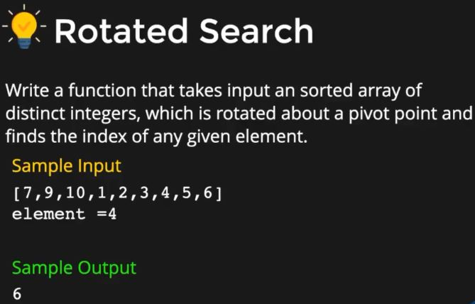

# DIVIDE AND CONQUER

## MERGE SORT

```C++
#include<iostream>
using namespace std;

void merge(vector<int> &array,int s,int e){
    int i = s;
    int m = (s+e)/2;
    int j = m+1;
    vector<int> temp;
    while(i<=m && j<=e){
        if(array[i] < array[j]){
            temp.push_back(array[i]);
            i++;
        }
        else{
            temp.push_back(array[j]);
            j++;
        }
    }
    //copy remaining elements from first array
    while(i<=m){
        temp.push_back(array[i++];)
    }
    //or copy from second array
    while(j<=e){
        temp.push_back(array[j++]);
    }
    //copy back the elements from temp to original aarray
    int k = 0;
    for(int idx=s;idx<=n;idx++){
        array[idx] = temp[k++];
    }
    return;
}

void mergesort(vector<int> & array,int s,int e){
    //base case
    if(s>=e){
        return;
    }
    //rec case
    int mid = (s+e)/2;
    mergesort(array,s,mid);
    mergesort(array,mid+1,e);
    return merge(array,s,e);
}

int main()
{
    vector<int> arr = {10,5,2,0,7,6,4};
    int s = 0;
    int e = arr.size()-1;
    mergesort(arr,s,e);
    for(int x : arr){
        cout<<x<<",";
    }
    return 0;
}
```

## QUICK SORT

 * Time complexity = O[n*log(n)].

```C++
#include<iostream>
using namespace std;

int partition(vector<int &a,int s,int e){
    int pivot = a[e];
    int i = s-1;
    for(int j=s;j<e;j++){
        if(a[j]<pivot){
            i++;swap(a[i],a[j]);
        }
    }
    swap(a[i+1],a[e]);
    return i+1;
}

void quicksort(vector<int> &a,int s,int e){
    //base case
    if(s>=e){
        return;
    }
    //rec case
    int p = partition(a,s,e);
    quicksort(a,s,p-1);
    quicksort(a,p+1,e);
}

int main()
{
    vector<int> arr{10,5,2,0,7,6,4};
    cout<<arr.size()<<endl;
    int n = arr.size();
    quicksort(arr,0,n-1);
    for(int x : arr){
        cout<<x<<" ";
    }
    return 0;
}
```

## EXAMPLE-1(Rotated search)



```C++

```