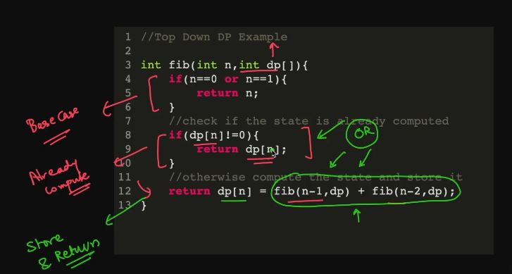
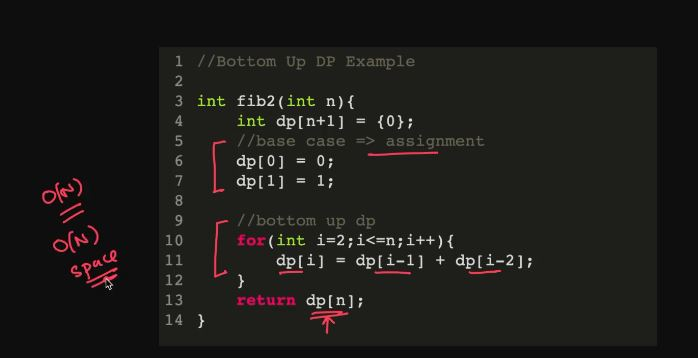
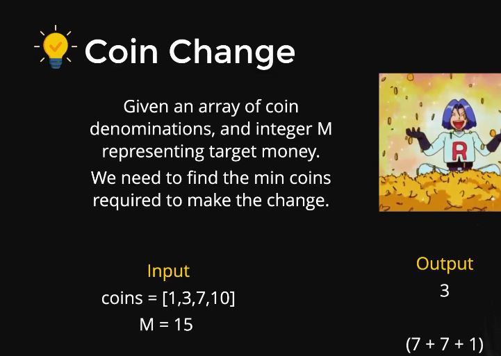
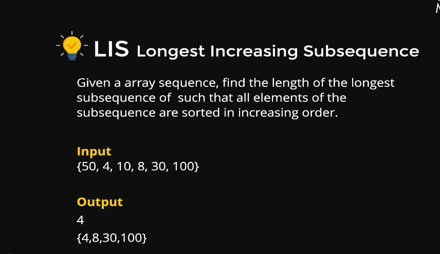

# DYNAMING PROGRAMING(DP)

1. Top down dp

2. Bottom up dp


## EXAMPLES

### COIN EXCHANGE



```C++
#include<iostream>
#include<vector>
#include<climits>
using namespace std;

//bottom up approach
int minnumberofcoinsforchange(int m,vector<int> denoms){
    vector<int> dp(m+1,0);
    dp[0] = 0;
    for(int i=1;i<=m;i++){
        dp[i] = INT_MAX;
        for(int c : denoms){
            if(i-c >=0 && dp[i-c]!=INT_MAX){
                dp[i] = min(dp[i],dp[i-c] + 1);
            }
        }
    }
    return dp[m]==INT_MAX? -1 : dp[m];
}

int main()
{
    vector<int> denoms = {1,5,7,10};
    int m = 8;
    cout<<minnumberofcoinsforchange(m,denoms);
    return 0;
}
```

### LONGEST COMMON SUBSEQUENCE(LIC)



```C++
#include<iostream>
#include<vector>
using namespace std;
//bottom up solution
int lis(vector<int> arr){
    int n = arr.size();
    vector<int> dp(n,1);
    int len = 1;
    for(int i=1;i<n;i++){
        for(int j=0;j<i;j++){
            if(arr[i] > arr[j]){
                dp[i] = max(dp[i],1 + dp[j]);
                len = max(len,dp[i]);
            }
        }
    }
    return len;
}
int main()
{
    vector<int> arr{50,4,10,8,30,100};
    cout<<lis(arr)<<endl;
    return 0;
}
```

### KNAPSACK PROBLEM


* Time and space complexity = O[NW]

```C++
#include<iostream>
#include<vector>
using namespace std;

//recursivecode top down
int knapsack(int wts[],int prices[],int N,int W){
    //base case
    if(N==0 || W==0){
        return 0;
    }
    //recursive case
    int inc = 0,exc = 0;
    if(wts[N-1]<=W){
        inc = prices[N-1] + knapsack(wts,prices,N-1,W-wts[N-1]);
    }
    exc = knapsack(wts,prices,N-1,W);
    return max(inc,exc);
}
//bottom uo dp
int knapsackdp(int wt[],int price[],int N,int W){
    vector<vector<int>> dp(N+1,vector<int>(W+1,0));
    for(int n=1;n<=N;n++){
        for(int w=1;w<=W;w++){
            int inc = 0,exc = 0;
            if(wt[n-1]<=w){
                inc = price[n-1] + dp[n-1][w-wt[n-1]];
            }
            exc = dp[n-1][w];
            dp[n][w] = max(inc,exc);
        }
    }
    return dp[N][W];
}

int main()
{
    int wts[] = {2,7,3,4};
    int prices[] = {5,20,20,10};
    int N = 4;
    int W = 11;
    cout<<knapsack(wts,prices,N,W)<<endl;
    //cout<<knapsackdp(wts,prices,N,W)<<endl;
    return 0;
}
```