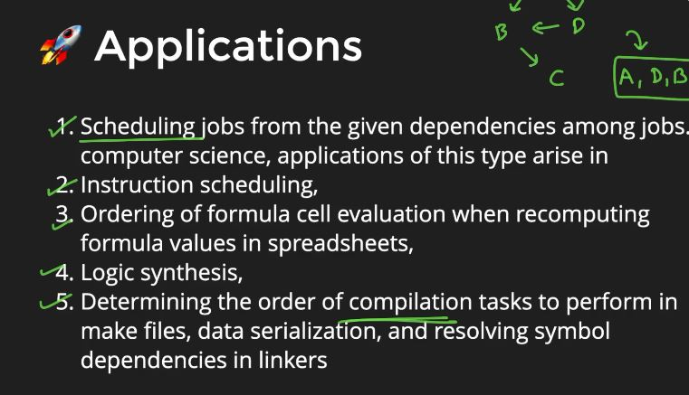

# GRAPS DATA STRUCTURE

1. Contain edges and vertices
2. Types are:-
* weighted/unweighted
* directed/bidirected

## STORING A GRAPH

1. Adjacency list
2. Adjacency matrix
3. Edge list
4. 2D matrix(Implicit graph)

## ADJACENCY LIST

```C++
#include<iostream>
#include<list>
using namespace std;

class Graphs{
    int V;
    list<int> *l;
    public:
        Graphs(int v){
            V = v;
            l = new list<int>[V];
        }
        void addedge(int i,int j,bool undir = true){
            l[i].push_back(j);
            if(undir){
                l[j].push_back(i);
            }
        }
        void print(){
            //iterate over all the rows
            for(int i=0;i<V;i++){
                cout<<i<<"-->";
                for(auto node : l[i]){
                    cout<<node<<",";
                }
                cout<<endl;
            }
        }
};

int main(){
    Graphs g(6);
    g.addedge(0,1);
    g.addedge(0,4);
    g.addedge(2,1);
    g.addedge(3,4);
    g.addedge(4,5);
    g.addedge(2,3);
    g.addedge(3,5);
    g.print();
    return 0;
}
```

## ADJACENCY LIST USING NODE CLASS

```C++
#include<iostream>
#include<list>
#include<string>
#include<unordered_map>
#include<vector>
using namespace std;

class Node{
    public:
    string name;
    list<string> nbrs;
    Node(string name){
        this->name = name;
    }
};

class Graph{
    unordered_map<string,Node*> m;
    public:
        Graph(vector<string> cities){
            for(auto city : cities){
                m[city] = new Node(city);
            }
        }
        void addedge(string x,string y,bool undir = false){
            m[x]->nbrs.push_back(y);
            if(undir){
                m[y]->nbrs.push_back(x);
            }
        }
        void print(){
            for(auto citypair : m){
                auto city = citypair.first;
                Node *node = citypair.second;
                cout<<city<<"-->";
                for(auto nbr : node->nbrs){
                    cout<<nbr<<",";
                }
                cout<<endl;
            }
        }
};

int main()
{
    vector<string> cities = {"delhi","london","paris","new york"};
    Graph g(cities);
    g.addedge("delhi","london");
    g.addedge("new york","london");
    g.addedge("delhi","paris");
    g.addedge("paris","new york");
    g.print();
    return 0;
}
```

## GRAPH TRAVERSALS

1. BFS(Breadth First Search).
2. DFS(Depth First Search).

### BFS

```C++
void bfs(int source){
    queue<int> q;
    bool *visited = new bool[V]{0};
    q.push(source);
    visited[source] = true;
    while(!q.empty()){
        int f = q.front();
        cout<<f<<endl;
        q.pop();
        //push the nbrs of current node inside q if they are not already been visited
        for(auto nbr : l[f]){
            if(!visited[nbr]){
                q.push(nbr);
                visited[nbr] = true;
            }
        }
    }
}
```

## DFS

```C++
void dfshelper(int node,bool *visited){
    visited[node] = true;
    cout<<node<<"-->";
    //make dfs call on all its unvisited neighbors
    for(int nbr : l[node]){
        if(!visited[nbr]){
            dfshelper(nbr,visited);
        }
    }
    return;
}
void dfs(int source){
    bool *visited = new bool[V]{0};
    dfshelper(source,visited);
}
```

## TOPOLOGICAL SORTING




## TOPOLOGICAL SORTING ALGORITHM(Kahn's algorithm, Modified BFS)

```C++
#include<iostream>
#include<map>
#include<list>
#include<queue>
#include<cstring>
#include<vector>
using namespace std;

class Graph{
    list<int> *l;
    int v;
    public:
        Graph(int v){
            this->v = v;
            l = new list<int>[v];
        }
        void addedge(int x, int y){
            //directed graph
            l[x].push_back(y);
        }
        void topological_sort(){
            vector<int> indegree(v,0);
            for(int i=0;i<v;i++){
                for(auto nbr : l[i]){
                    indegree[nbr]++;
                }
            }
            queue<int> q;
            for(int i=0;i<v;i++){
                if(indegree[i]==0){
                    q.push(i);
                }
            }
            while(!q.empty()){
                int node = q.front();
                cout<<node<<"-->";
                q.pop();
                for(auto nbr : l[node]){
                    indegree[nbr]--;
                    if(indegree[nbr]==0){
                        q.push(nbr);
                    }
                }
            }
        }
};

int main()
{
    Graph g(6);
    g.addedge(0,2);
    g.addedge(1,2);
    g.addedge(1,4);
    g.addedge(2,3);
    g.addedge(3,5);
    g.addedge(4,5);
    g.topological_sort();
    return 0;
}
```

## DIJKSHTRA's ALGORITHM

```C++
#include<iostream>
#include<map>
#include<list>
#include<queue>
#include<cstring>
#include<vector>
#include<set>
using namespace std;

class Graph{
    list<pair<int,int>> *l;
    int V;
    public:
        Graph(int v){
            V = v;
        }
        void addedge(int u, int v,int wt,bool undir = true){
            l[u].push_back({wt,v});
            if(undir){
                l[v].push_back({wt,u});
            }
        }
        int dijkstra(int src,int dest){
            //data structure
            vector<int> dist(V,INT_MAX);
            set<pair<int,int>> s;
            //l.init
            dist[src] = 0;
            s.insert({0,src});
            while(!s.empty()){
                auto it = s.begin();
                int node = it->second;
                int disttillnow = it->first;
                s.erase(it);
                for(auto nbrpair : l[node]){
                    int nbr = nbrpair.second;
                    int currentedge = nbrpair.first;
                    if(disttillnow + currentedge < dist[nbr]){
                        //remove if such a pair already exists
                        auto f = s.find({dist[nbr],nbr});
                        if(f!=s.end()){
                            s.erase(f);
                        }
                        dist[nbr] = disttillnow + currentedge;
                        s.insert(dist[nbr],nbr);
                    }
                }
            }
            for(int i=0;i<V;i++){
                cout<<"Node is"<<i<<"Dist"<<dist[i]<<endl;
            }
            return dist[dest];
        }
};

int main()
{
    Graph g(5);
    g.addedge(0,1,1);
    g.addedge(1,2,2);
    g.addedge(0,2,4);
    g.addedge(0,3,7);
    g.addedge(3,2,2);
    g.addedge(3,4,3);
    return 0;
}
```