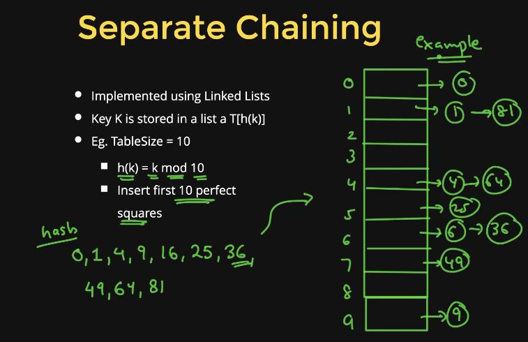

## HASHTABLE

* It is a type of unordered data structure.
1. Searching = O[1]
2. Insert = O[1]
3. Remove = O[1]
* Hash function = [Object] ===> Integer value.(Keys need to be converted into an integer value).
* Key components:
1. Hash function(Design)
2. Hash table(Array)
3. Collision handling scheme
* A hashtable is an array of fixed size(it can grow based upon need).
* Array elements are indexed by a key, which is mapped to an array index(0 to table_size - 1).
* Mapping(hash function):
1. h from key to index.
2. h("john") = 12.

## COLLISION FUNCTION

* Idealy tablesize must be prime.
* Add ascii values of strings to produce its integer key.
* Better aproach can be takong a weighted sum of characters.

### HANDLING COLLISIONS

1. Open hashing = Seperate Chaining Technique.
2. Closed hashing = linear probing and quadratic probing.
3. Double hashing.

4. Load factor = current_size/table_size.

## SETUP INSERTION REHASHING

```C++
#include<iostream>
#include<string>
using namespace std;

template<typename T>
class Node{
    public:
        string key;
        T value;
        Node *next;
        Node(string key,T value){
            this->key = key;
            this->value = value;
            next = NULL;
        }
        ~Node(){
            if(next!=NULL){
                delete next;
            }
        }
};

template<typename T>
class Hashtable{
    Node<T> **table;
    int cs; //total entries that have been inserted
    int ts; //size of table
    int hashfn(string key){
        int idx = 0;
        int power = 1;
        for(auto ch : key){
            idx = (idx + ch*power)%ts;
            power = (power*29)%ts;
        }
        return idx;
    }
    void rehash(){
        //save the ptr in the oldtable
        Node<T> **oldTable = table;
        int oldTs = ts;
        //increase table size
        cs = 0;
        ts = 2*ts + 1;
        table = new Node<T> *[ts]; //you should make it prime
        for(int i=0;i<ts;i++){
            table[i] = NULL;
        }
        //copy elements from oldtable to new table
        for(int i=0;i<oldTs;i++){
            Node<T> *temp = oldTable[i];
            while(temp!=NULL){
                string key = temp->key;
                T value = temp->value;
                //happen in new table
                insert(key,value);
                temp = temp->next;
            }
            //destroy the ith linked list
            if(oldTable[i]!=NULL){
                delete oldTable[i];
            }
        }
        delete [] oldTable;
    }
    public:
        Hashtable(int default_size = 7){
            cs = 0;
            ts = default_size;
            table = new Node<T>*[ts];
            for(int i=0;i<ts;i++){
                table[i] = NULL;
            }
        }
        void insert(string key, T val){
            int idx = hashfn(key);
            Node<T>* n = new Node<T>(key,val);
            //Insertion at head of the linked list
            n->next = table[idx];
            table[idx] = n;
            cs++;
            float load_factor = float(cs)/float(ts);
            if(load_factor > 0.7){
                rehash();
            }
        }
        T *search(string key){
            int idx = hashfn(key);
            Node<T> *temp = table[idx];
            while(temp!=NULL){
                if(temp->key == key){
                    return &temp->value;
                }
                temp = temp->next;
            }
            return NULL;
        }
        void erase(string key){
            int idx = hashfn(key);
            Node<T> *temp = table[idx];
            Node<T> *prev = NULL;
            while(temp!=NULL){
                if(temp->key == key){
                    if(prev==NULL){
                        table[idx] = temp->next;
                    }
                    else{
                        prev->next = temp->next;
                    }
                    delete temp;
                    return;
                }
                prev = temp;
                temp = temp->next;
            }
            return;
        }
        T& operator[](string key){
            //return the value
            //if key is not found then create a new node and return
            //return the existing node
            T* valueFound = search(key);
            if(valueFound==NULL){
                T object;
                insert(key,object);
                valueFound = search(key);
            }
            return *valueFound;
        }
        void print(){
            //iterate over buckets
            for(int i=0;i<ts;i++){
                cout<<"Bucket "<<i<<"->";
                Node<T> *temp = table[i];
                while(temp!=NULL){
                    cout<<temp->key<<"->";
                    temp = temp->next;
                }
                cout<<endl;
            }
        }
};
int main()
{
    Hashtable<int> h;
    h.insert("mango",100);
    h.insert("apple",120);
    h.insert("banana",80);
    h.insert("litchi",170);
    h.insert("orange",200);
    h.insert("papaya",30);
    h.insert("kiwi",90);
    h.insert("guava",50);
    //h.print();
    // string fruit;
    // cin>>fruit;
    // int *price = h.search(fruit);
    // if(price!=NULL){
    //     cout<<"Price of fruit is "<<*price<<endl;
    // }
    // else{
    //     cout<<"fruit not found"<<endl;
    // }
    // string fruit2;
    // cin>>fruit2;
    // h.erase(fruit2);
    // h.print();
    //supercool functionality
    h["newFruit"] = 200;
    cout<<"New fruit cost : "<<h["newFruit"]<<endl;
    h["newFruit"] += 20;
    cout<<"New fruit cost : "<<h["newFruit"]<<endl;
    return 0;
}
```