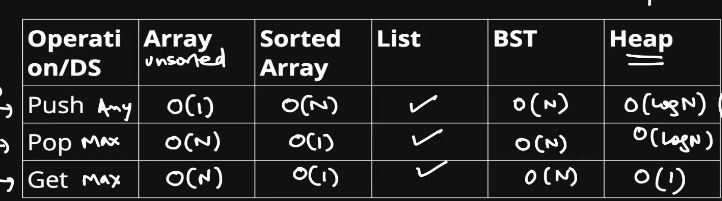
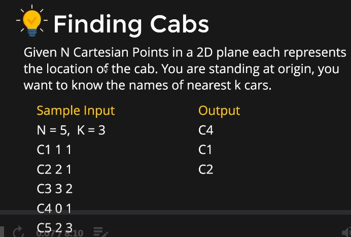

# HEAPS/PRIORITY QUEUES

## INTRODUCTION

* It is a type of priority queue. O(N + LogN)
* Methods are :-
1. Insert O(LogN)
2. Pop max/min O(LogN)
3. Get max/min O(1)



## HEAPS

1. Binary Tree: at most 2 children.
2. Complete Binary Tree(CBT): all levels should be completely filled except last level, but it should be filled in left to right order.
3. Heap Order Property: Parent node >= child node(Max heap), parent nade < child node(Min heap).
4. For any sequence to be a heap must follow all the above properties.

## HEAPS AS ARRAY

A CBT can be converted easily into an array and the operation of searching node to insert is also of O[N].

## INSERTION AND REMOVE

```C++
#include<vector>
using namespace std;

class Heap{
    vector<int> v;

    void heapify(int i){
        int left = 2*i;
        int right = 2*i + 1;
        int minidx = i;
        if(left<v.size() && v[left]<v[i]){
            minidx = left;
        }
        if(right<v.size() && v[right]<v[i]){
            minidx = right;
        }
        if(minidx!=i){
            swap(v[i],v[minidx]);
            heapify(minidx);
        }
    }
    public:
    Heap(int default_size = 10){
        v.reserve(default_size+1);
        v.push_back(-1);
    }
    void push(int data){
        //add data at the end of the heap
        v.push_back(data);
        int idx = v.size() - 1;
        int parent = idx/2;
        while(index>1 && v[index] < v[parent]){
            swap(v[index],v[parent]);
            index = parent;
            parent = parent/2;
        }
    }
    //return min element
    void min(){
        return v[1];
    }
    //remove min element
    void pop(){
        //swap first and last element
        int idx = v.size() - 1;
        swap(v[1],v[idx]);
        v.pop_back();
        heapify(1);
    }
    bool empty(){
        return v.size()==1;
    }
};
```

## PRIORITY QUEUE IN STL

```C++
#include<iostream>
#include<queue>
using namespace std;

class compare{
    public:
        bool operator()(int a,int b){
            return a<b;
        }
}

int main()
{
    int arr[] = {10,15,20,13,6,90};
    int n = sizeof(arr)/sizeof(int);
    //priority_queue<int,vector<int>,greater<int>> heap;
    priority_queue<int,vector<int>,compare> heap;
    for (int x : arr)
    {
        heap.push(x);
    }
    while(!heap.empty()){
        cout<<heap.top()<<endl;
        heap.pop();
    }
    return 0;
}
```

## EXAMPLE-1



```C++
#include<iostream>
#include<queue>
#include<vector>
#include<algorithm>
using namespace std;

class Car{
    public:
        string id;
        int x,y;
        Car(string id,int x,int y){
            this->id = id;
            this->x = x;
            this->y = y;
        }
        int dist() const{
            return x*x + y*y; //square of the distance
        }
};

class carcompare{
    public:
    bool operator()(const Car A,const Car B){
        return A.dist() < B.dist();
    }
};

void printNearestCars(vector<Car> cars,int k){
    //create a max heap of size k
    priority_queue<Car,vector<Car>, carcompare> max_heap(cars.begin(),cars.begin()+k);
    //remaining cars
    for(int i=k; i < cars.size();i++){
        auto car = cars[i];
        if(car.dist() < max_heap.top().dist()){
            max_heap.pop(); //remove the root node largest
            max_heap.push(car);
        }
    }
    //print all the cars inside the heap they will be the smallest
    vector<Car> output;
    while(!max_heap.empty()){
        //cout<<max_heap.top().id<<endl;
        output.push_back(max_heap.top());
        max_heap.pop();
    }
    //vector of k nearest elements
    reverse(output.begin(),output.end());
    for(auto car : output){
        cout<<car.id<<endl;
    }
    return;
}

int main()
{
    int N,K;
    cin>>N>>K;
    string id;
    int x,y;
    vector<Car> cars;
    for(int i=0;i<N;i++){
        cin>>id>>x>>y;
        Car car(id,x,y);
        cars.push_back(car);
    }
    printNearestCars(cars,K);
    return 0;
}
```