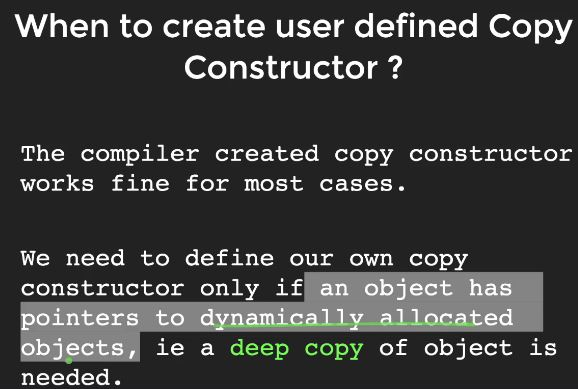

# OOPs

* Objects : Entities in real world

## GETTERS AND SETTERS

```C++
#include<iostream>
using namespace std;

class product{
    private:
        int id;
        char name[100];
        int mrp;
        int selling_price;
    public:
    //setters
        void setmrp(int price){
            if(price>=0){
            mrp = price;
            }
        }
        void setselling_price(int price){
            if(price>mrp){
                selling_price = mrp;
            }
            else{
            selling_price = price;
            }
        }
    //getters
            int getmrp(){
                return mrp;
            }
            int getselling_price(){
                return selling_price;
            }
};

int main()
{
    product camera;
    camera.setmrp(100);
    camera.setselling_price(200);
    cout<<sizeof(camera)<<endl;
    cout<<"MRP "<<camera.getmrp()<<endl;
    cout<<"SELLING PRICE "<<camera.getselling_price()<<endl;
    return 0;
} 
```

## CONSTRUCTORS

```C++

    public:
    product(){
        cout<<"Inside the constructor"<<endl;
    }
    //parameterised constructor
    product(int id,char *n,int mrp,int selling_price){
        this->id = id;
        strcpy(name,n);
        this->mrp = mrp;
        this->selling_price = selling_price;
    }
```

## COPY CONSTRUCTOR

> product webcam(camera);

```C++
#include<iostream>
using namespace std;

class product{
    private:
        int id;
        char name[100];
        int mrp;
        int selling_price;
    public:
    product(){
        cout<<"Inside the constructor"<<endl;
    }
    //parameterised constructor
    product(int id,char *n,int mrp,int selling_price){
        this->id = id;
        strcpy(name,n);
        this->mrp = mrp;
        this->selling_price = selling_price;
    }
    //copyconstructor
    product(product &x){
        id = x.id;
        mrp = x.mrp;
        selling_price  = x.selling_price;
        strcpy(name,x.name);
    }
            void showdetails(){
                cout<<"Name : "<<name<<endl;
                cout<<"Id : "<<id<<endl;
                cout<<"Selling price : "<<selling_price<<endl;
                cout<<"Mrp : "<<mrp<<endl; 
            }
};

int main()
{
    product camera(101,"goprohero9",28000,26000);
    //camera.showdetails();
    product handycam = camera;
    product webcam(camera);
    webcam.showdetails();
    handycam.showdetails();
    return 0;
} 
```

## SHALLOW AND DEEP COPY

```C++
#include<iostream>
using namespace std;

class product{
    private:
        int id;
        char *name;
        int mrp;
        int selling_price;
    public:
    product(){
        cout<<"Inside the constructor"<<endl;
    }
    //parameterised constructor
    product(int id,char *n,int mrp,int selling_price){
        this->id = id;
        name = new int[strlen(n)+1];
        strcpy(name,n);
        this->mrp = mrp;
        this->selling_price = selling_price;
    }
            void showdetails(){
                cout<<"Name : "<<name<<endl;
                cout<<"Id : "<<id<<endl;
                cout<<"Selling price : "<<selling_price<<endl;
                cout<<"Mrp : "<<mrp<<endl; 
            }
            //setters
            void setname(char *name){
                strcpy(this->name,name);
            }
};

int main()
{
    product camera(101,"goprohero9",28000,26000);
    product old_camera(camera);
    //shallowcopy
    old_camera.setname("gopro8");
    camera.showdetails();
    old_camera.showdetails();
    return 0;
}                           
```

```C++
product(product &x){
        id = x.id;
        mrp = x.mrp;
        selling_price = x.selling_price;
        //deep copy
        name = new char[strlen(x.nam)+1];
        strcpy(name,x.name);
    }
```

;

;

## COPY ASSIGNMENT OPERATOR

```C++
void operator=(product &x){
    //deep copy using assignment operator
    id = x.id;
        mrp = x.mrp;
        selling_price = x.selling_price;
        //deep copy
        name = new char[strlen(x.nam)+1];
        strcpy(name,x.name);
}
```

## DESTRUCTOR

;

```C++
~product(){
    cout<<"Deleting "<<name<<endl;
    if(name!=NULL){
        delete [] name;
        name = NULL;
    }
    }
```

## PROTECTED vs PRIVATE

* The class member declared as Protected are inaccessible outside the class but they can be accessed by any subclass(derived class) of that class. Private member are not inherited in class. Protected member are inherited in class.