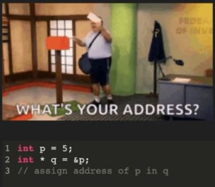
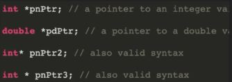

# POINTERS AND DYNAMIC MEMORY

## ADDRESS OPERATOR(&)

If we print the address of the variable than it will be always a hexadecimal number.



```C++
#include<iostream>
using namespace std;
int main()
{
    int x = 10;
    float y = 10;
    cout<<&x<<" "<<&y<<endl;
    return 0;
}
```

## POINTERS

A pointer is avariable that holds the address of another variable.

To declare a pointer, we use an asterisk(*) between the data type and the variable name.



```C++
#include<iostream>
using namespace std;
int main()
{
    int x = 10;
    int *xptr = &x;
    cout<<xptr<<endl;
    //address of a pointer variable
    cout<<&xptr<<endl;
    //xptr is address while *xptr will return the value of x
    return 0;
}
```

## DEREFRENCE OPERATOR(*)

An interesting property of pointersis that they can be used to access the variable they point to directly. this is done by preceding the pointer name with the derefrence operator(*). 

The operator itself can be read as **value pointed to by**.

### NULL POINTER

Sometimes it is useful to make our pointer point to nothing. This is called a null pointer.

We assign a pointer a null value by setting it to address 0;

> int *p = 0;
> int *q = NULL;

## REFRENCE OPERATOR(&)

Used to pass objects by refrence.

> int x = 10;
> int &y = x;

y will point toward address of same x.

```C++
#include<iostream>
using namespace std;
int main()
{
    int x = 10;
    int &y = x;
    y++;
    X++;
    cout<<x<<endl;
    cout<<y<<endl;
    return 0;
}
```

## PASS BY REFRENCE

### REFRENCE VARIABLE

```C++
#include<iostream>
using namespace std;

//pass by refrence
void applytax(int &income){
    float tax = 0.1;
    income = income - income*tax;
}

int main()
{
    int income;
    cin>>income;
    applytax(income);
    cout<<income<<endl;
    return 0;
}
```

### POINTERS

```C++
#include<iostream>
using namespace std;

//pass by refrence
void watchvideo(int *viewsptr){
    *viewsptr = *viewsptr + 1;
}

int main()
{
    int views = 100;
    watchvideo(&views);
    cout<<views<<endl;
    return 0;
}
```

## DYNAMIC MEMORY ALLOCATION

### STATIC MEMORY

It is a type of memory allocation in which all the data is stored in stack memory, which is created and destroyed by compiler itself.

### DYNAMIC MEMORY

It is a type of a runtime allocation in which all the data is created and stored in runtime, in a heap memory.

> int *arr = new int[n];

The pointer arr is stored in a stack as aststic allocation while new int[n] is stored in a heap dynamically the pointer will point toward the heap allocation, so after the programme is finished the stack gates deallocated i.e, pointer get deleted while the heap memory remain and don't get deleted until or unless a delete function is passed. 

> arr[i] = *(arr+i)

### MEMORY LEAK

If we forget to use the delete keyword after the completion of the programme then the pointer address will get deleted so we don't have the address of the dynamic memory again hence that part of memory get's wasted.

### USING NEW AND DELETE

```C++
#include<iostream>
using namespace std;
int main()
{
    int n;
    cin>>n;
    //dynamic array
    int *arr = new int[n];
    for(int i=0;i<n;i++){
        arr[i] = i;
        cout<<arr[i]<<" ";
    }
    //delete
    delete [] arr;
    cout<<arr<<endl;
    return 0;
}
```

## 2D DYNAMIC ARRAY

```C++
#include<iostream>
using namespace std;

int** create2darray(int rows, int cols){
    int** arr = new int*[rows];
    //allocate memory of each row
    for(int i=0;i<rows;i++){
        arr[i] = new int[cols];
    }
    //init the array
    int value = 0;
    for(int i=0;i<rows;i++){
        for(int j=0;j<cols;j++){
            arr[i][j] = value;
            value++;
        }
    }
    return arr;
    delete [] arr;
}

int main()
{
    int rows, cols;
    cin>>rows>>cols;
    int** arr = create2darray(rows,cols);
    for(int i=0;i<rows;i++){
        for(int j=0;j<cols;j++){
            cout<<arr[i][j]<<" ";
        }
        cout<<endl;
    }
    delete [] arr;
    return 0;
}
```