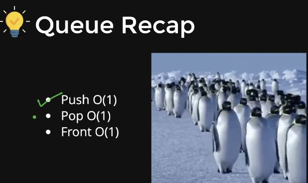

# QUEUES



## QUEUE USING CIRCULAR ARRAY

**HEADER FILE**

```C++
class Queue{
    private:
        int *arr;
        int cs;
        int ms;
        int front;
        int rear;
    public:
        Queue(int default_size=5){
            ms = default_size;
            arr = new int[ms];
            cs = 0;
            front = 0;
            rear = ms - 1;
        }
        bool full(){
            return cs==ms;
        }
        bool empty(){
            return cs==0;
        }
        void push(int data){
            if(!full()){
            //take rear to next index
            rear = (rear + 1)%ms;
            arr[rear] = data;
            cs++;
            }
        }
        void pop(){
            if(!empty()){
                //take the front pointer forward
                front = (front + 1)%ms;
                cs--;
            }
        }
        int getfront(){
            return arr[rear];
        }
};
```

**MAIN FILE**

```C++
#include<iostream>
#include"Queues.h"
using namespace std;
int main()
{
    Queue myqueue(7);
    myqueue.push(1);
    myqueue.push(2);
    myqueue.push(3);
    myqueue.push(4);
    myqueue.push(5);
    myqueue.push(6);
    myqueue.push(7);
    myqueue.push(8);
    myqueue.pop();
    myqueue.pop();
    myqueue.push(9);
    while (!myqueue.empty())
    {
        cout<<myqueue.getfront()<<endl;
        myqueue.pop();
    }
    
    return 0;
}
```

## QUEUE STL

```C++
#include<iostream>
#include<queue>
using namespace std;
int main()
{
    queue<int> q;
    q.push(1);
    q.push(2);
    q.push(3);
    q.push(4);
    q.push(5);
    while (!q.empty())
    {
        cout<<q.front()<<" ";
        q.pop();
    }
    
    return 0;
}
```

## STACK USING 2 QUEUES

```C++
#include<iostream>
#include<stack>
#include<queue>
using namespace std;

class Stack{
    queue<int> q1,q2;
    public:
        bool empty(){
            return q1.empty() && q2.empty();
        }
        void push(int x){
            //will insert in non-empty queue
            if(!q1.empty()){
                q1.push(x);
            }
            else{
                q2.push(x);
            }
        }
        void pop(){
            if(q1.empty()){
                //shift the elements from q2 to q1
                while(!q2.empty()){
                    int front = q2.front();
                    q2.pop();
                    if(q2.empty()){
                        break;
                    }
                    q1.push(front);
                }
            }
            else{
                //shift the elements from q1 and q2
                while(!q1.empty()){
                    int front = q1.front();
                    q1.pop();
                    if(q1.empty()){
                        break;
                    }
                    q2.push(front);
                }
            }
        }
        int top(){
            if(q1.empty()){
                //shift the elements from q2 to q1
                while(!q2.empty()){
                    int front = q2.front();
                    q2.pop();
                    q1.push(front);
                    if(q2.empty()){
                        return front;
                    }
                }
            }
            else{
                while(!q1.empty()){
                    int front = q1.front();
                    q1.pop();
                    q2.push(front);
                    if(q1.empty()){
                        return front;
                    }
                }
            }
        }
};

int main()
{
    Stack s;
    s.push(1);
    s.push(2);
    s.push(3);
    s.push(4);
    s.pop();
    while(!s.empty()){
        cout<<s.top()<<" ";
        s.pop();
    }
    cout<<endl;
    return 0;
}
```