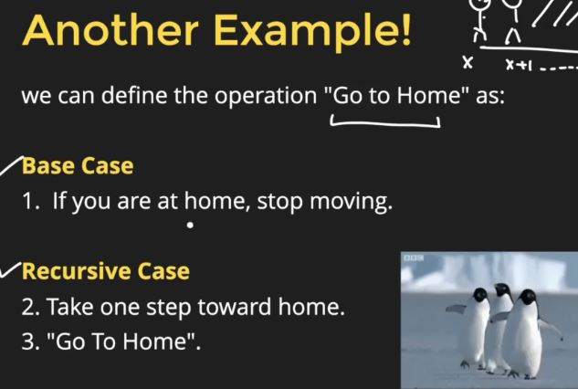
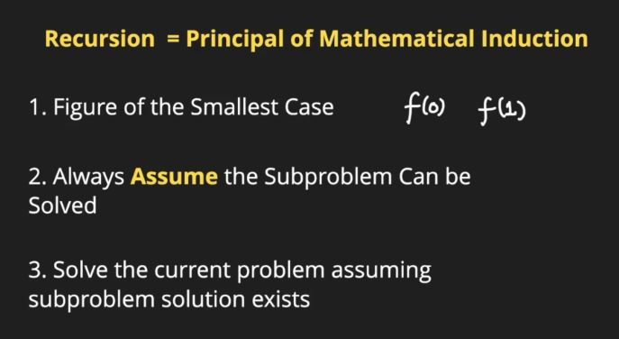
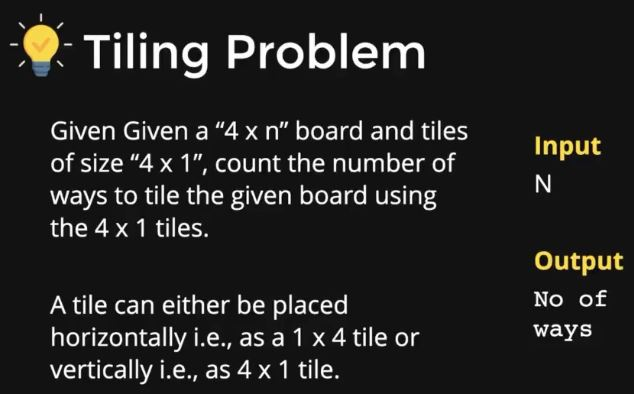
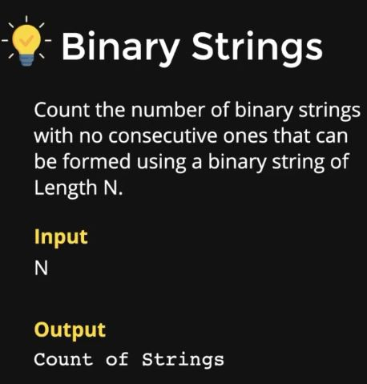
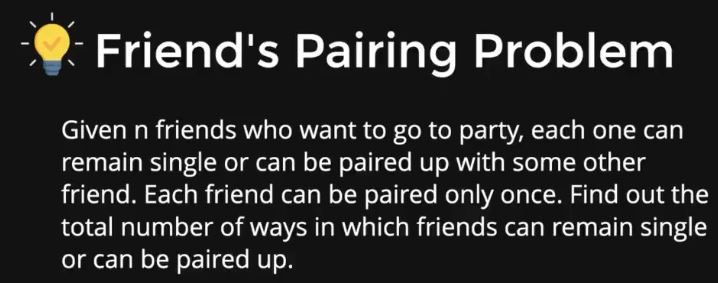

# RECURSION BASICS

*Recursion* in computer science is a technique where the solution to a problem depends on solution to *smaller instances of the same problem*.

**BASE CASE** => when we cannot move any further as we have already reached the value which will give us the final answer.





## EXAMPLE-1(Factorial)

* Time and space complexity = O[n].
* All recursive problems take extra space, becoz of the concept of implicit stack.

```C++
#include<iostream>
using namespace std;

int fact(int n){
    //base case
    if(n==0){
        return 1;
    }
    //rec case
    else{
        int ans = n*fact(n-1);
        return ans;
    }
}

int main()
{
    int n;
    cin>>;
    cout<<fact(n);
    return 0;
}
```

## EXAMPLE-2(Fibonacci series)

* Time complexity is O[2^n] and space complexity is O[n].

```C++
#include<iostream>
using namespace std;

int fib(int n){
    //basic case
    if(n==0 || n==1){
        return n;
    }
    //rec case
    int f1 = fib(n-1);
    int f2 = fib(n-2);
    return f1 + f2;
}

int main()
{
    int n;
    cin>>n;
    cout<<fib(n)<<endl;
    return 0;
}
```

## EXAMPLE-3(Sort check)

```C++
#include<iostream>
using namespace std;

bool issorted(int arr[],int n){
    //base case
    if(n==1 || n==0){
        return true;
    }
    //rec case
    if(arr[0]<arr[1] && issorted(arr+1,n-1)){
        return true;
    }
    return false;
}

bool issortedtwo(int arr[],int i,int n){
    //base case
    if(i==n-1){
        return true;
    }
    //rec case
    if(arr[i]<arr[i+1] && issortedtwo(arr,i+1,n)){
        return true;
    }
    return false
}

int main()
{
    int arr[] = {1,2,3,5,4,6};
    int n = sizeof(arr)/sizeof(int);
    cout<<issorted(arr,n);
    return 0;
}
```

## EXAMPLE-4(Print numbers)

```C++
#include<iostream>
using namespace std;

void dec(int n){
    //base case
    if(n==0){
        return;
    }
    //rec case;
    cout<<n<<",";
    dec(n-1};
}

void inc(int n){
    //base case
    if(n==0){
        return;
    }
    //rec case
    inc(n-1);
    cout<<n<<",";
}

int main()
{
    int n;
    cin>>n;
    dec(n);
    cout<<endl;
    inc(n);
    return 0;
}
```

## EXAMPLE-5(First occurence)

```C++
#include<iostream>
using namespace std;

int firstocc(int arr[],int n,int key){
    //base case
    if(n==0){
        return -1;
    }
    //rec case
    if(arr[0]==key){
        return 0;
    }
    int subindex = firstocc(arr+1,n-1,key);
    if(subindex!=1){
        return subindex + 1;
    }
    return -1;
}

int main()
{
    int arr[] = {1,3,5,7,6,2,11,21};
    int n = sizeof(arr)/sizeof(int);
    int key = 7;
    cout<<firstocc(arr,n,key)<<endl;
    return 0;
}
```

## EXAMPLE-6(Last occurence)

```C++
#include<iostream>
using namespace std;

int lastocc(int arr[],int n,int key){
    //base case
    if(n==0){
        return -1;
    }
    //rec case
    int subindex = lastocc(arr+1,n-1,key);
    if(subindex==-1){
        if(arr[0]==key){
        return 0;
    }
    else{
        return -1;
    }
    }
    else{
        return subindex + 1;
    }
}

int main()
{
    int arr[] = {1,3,5,7,6,2,11,21};
    int n = sizeof(arr)/sizeof(int);
    int key = 7;
    cout<<lastocc(arr,n,key)<<endl;
    return 0;
}
```

## EXAMPLE-7(Power function)

* Time and space complexity = O[n].
* Time complexity and space complexity of optimised way = O[log(n)].

```C++
#include<iostream>
using namespace std;

int power(int a,int n){
    //base case
    if(n==0){
        return 1;
    }
    return a*power(a,n-1);
}

//optimised way
int fastpower(int a,int n){
    if(n==0){
        return 1;
    }
    int subprob = fastpower(a,n/2);
    int subprobsq = subprob*subprob;
    if(n&1){
        return a*subprobsq;
    }
    return subprobsq;
}

int main()
{
    int a,n;
    cin>>a>>n;
    cout<<power(a,n)<<endl;
    //optimised
    cout<<fastpower(a,int n)<<endl;
    return 0;
}
```

## EXAMPLE-8(Bubble sort)

**Iterative approach is better than reccursive approach.**

```C++
#include<iostream>
using namespace std;

void bubblesortrec(int a[],int n){
    //base case
    if(n==1){
        return;
    }
    for(int j=0;j<n-1;j++){
        if(a[j]>a[j+1]){
            swap(a[j],a[j+1]);
        }
        bubblesortrec((a,n-1));
    }
}

void bubblesortrec2(int a[],int n,int j){
    //base case
    if(n==1 || n==0){
        return;
    }
    if(j==n-1){
        bubblesortrec2(a,n-1,0);
        return;
    }
        if(a[j]>a[j+1]){
            swap(a[j],a[j+1]);
        bubblesortrec2(a,n,j+1);
    }
}

int main()
{
    int a[] = {3,5,1,4,2},n;
    cin>>n;
    bubblesortrec(a[],n);
    for(int i=0;i<n;i++){
        cout<<a[i]<<" ";
    }
    return 0;
}
```

## EXAMPLE-9(Number spell)

```C++
#include<iostream>
#include<string>
using namespace std;

string spell = {"zero","one","two","three","four","five","six","seven","eight","nine"};

void printspell(int n){
    if(n==0){
        return;
    }
    int last_digit = n%10;
    printspell(n/10);
    cout<<spell[last_digit]<<" ";
}

int main()
{
    int n;
    cin>>n;
    printspell(n);
    return 0;
}
```

## EXAMPLE-10(Tiling problem)



```C++
#include <iostream>
using namespace std;
 
int helperTillingProblem(int n, int m)
{
    //Recurrence Relation => T(n) = T(n-1) + T(n-m)
    
    //Base Case
    if(n == m)
    {
        return 2;
    }
    if(n < m || n == 1)
    {
        return 1;
    }
    
    //Recursive Case
    return helperTillingProblem(n - 1, m) + helperTillingProblem(n - m, m);
}
 
int tillingProblem(int n, int m)
{
    int ways = helperTillingProblem(n, m);
    return ways;
}
```

## EXAMPLE-11(Binary strings)



* Time complexity = O[2^n].

```C++
// all binary string without
// consecutive 1's of size K
#include<bits/stdc++.h>
using namespace std ;
 
// A utility function generate all string without
// consecutive 1'sof size K
void generateAllStringsUtil(int K, char str[], int n)
{
     
    // Print binary string without consecutive 1's
    if (n  == K)
    {
         
        // Terminate binary string
        str[n] = '\0' ;
        cout << str << " ";
        return ;
    }
 
    // If previous character is '1' then we put
    // only 0 at end of string
    //example str = "01" then new string be "010"
    if (str[n-1] == '1')
    {
        str[n] = '0';
        generateAllStringsUtil (K , str , n+1);
    }
 
    // If previous character is '0' than we put
    // both '1' and '0' at end of string
    // example str = "00" then
    // new string "001" and "000"
    if (str[n-1] == '0')
    {
        str[n] = '0';
        generateAllStringsUtil(K, str, n+1);
        str[n] = '1';
        generateAllStringsUtil(K, str, n+1) ;
    }
}
 
// Function generate all binary string without
// consecutive 1's
void generateAllStrings(int K )
{
    // Base case
    if (K <= 0)
        return ;
 
    // One by one stores every
    // binary string of length K
    char str[K];
 
    // Generate all Binary string
    // starts with '0'
    str[0] = '0' ;
    generateAllStringsUtil ( K , str , 1 ) ;
 
    // Generate all Binary string
    // starts with '1'
    str[0] = '1' ;
    generateAllStringsUtil ( K , str , 1 );
}
 
// Driver program to test above function
int main()
{
    int K = 3;
    generateAllStrings (K) ;
    return 0;
}
```

## EXAMPLE-12(Friends pairing)



* Time complexity = O[2^n].

```C++
int friendsPairing(int n){
    if(n==1){
        return 1;
    }
    if(n==2){
        return 2;
    }
    else{
        return friendsPairing(n-1)+ (n-1)*friendsPairing(n-2);
    }
}
```