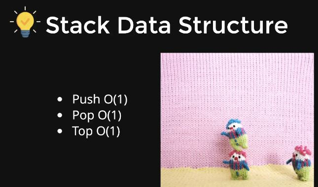
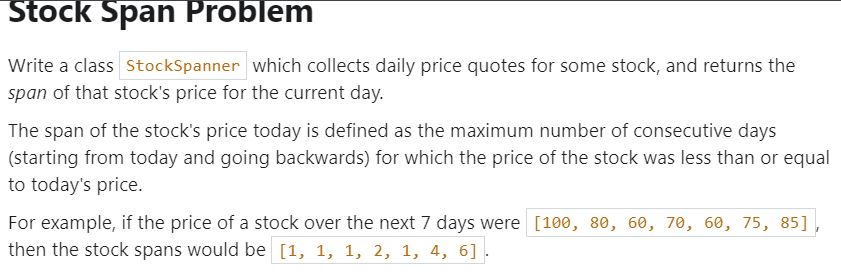

# STACKS

## STACK DATA STRUCTURES



* TOP(): Print out the top most element in the stack.
* POP(): Popout the top most element in the stack.
* PUSH(): Push an element inside the stack at the top position.
* It is used as for undo-redo operation in the computers.

## STACK IMPLEMENTATION USING

### LINKED LIST

**HEADER FILE**
* "Stack.h"
```C++
template<typename T>
class Stack;

template<typename T>
class Node{
    public:
        T data;
        Node<T> *next;
        Node(T d){
            data = d;
        }
};

template<typename T>
class Stack{
    Node<T> *head;
    public:
    Stack(){
        head = NULL;
    }
    void push(T data){
        Node<T> *n = new Node<T>(data);
        n->next = head;
        head = n;
    }
    bool empty(){
        return head==NULL;
    }
    T top(){
        return head->data;
    }
    void pop(){
        if(head!=NULL){
            Node<T> *temp = head;
            head = head->next;
            delete temp;
        }
    }
};
```

**MAIN FILE**

```C++
#include<iostream>
#include"Stack.h"
using namespace std;

int main()
{
    stack<char> s;
    s.push('h');
    s.push('e');
    s.push('l');
    s.push('l');
    s.push('o');
    while(!s.empty()){
        cout<<s.top()<<endl;
        s.pop();
    }
    return 0;
}
```

### VECTOR

```C++
#include<iostream>
#include<vector>
using namespace std;

template<typename T>
class stack{
    vector<T> arr;
    public:
    void push(T data){
        arr.push_back(data);
    }
    void pop(){
        arr.pop_back();
    }
    T top(){
        int lastIndex = arr.size() - 1;
        return arr[lastIndex];
    }
    bool empty(){
        return arr.size()==0;
    }
};

int main()
{
    stack<int> v;
    v.push(5);
    v.push(4);
    v.push(3);
    v.push(2);
    v.push(1);
    while(!v.empty()){
        cout<<v.top()<<endl;
        v.pop();
    }
    return 0;
}
```

## STACK STL

```C++
#include<iostream>
#include<stack>
#include<string>
using namespace std;
int main()
{
    stack<string> books;
    books.push("C++");
    books.push("PYTHON");
    books.push("JAVA");
    books.push("OS");
    while(!books.empty()){
        cout<<books.top()<<" ";
        books.pop();
    }
    return 0;
}
```

## STACK INSERT AT BOTTOM CHALLENGE

* STL container stack is passed by value by default.

```C++
#include<iostream>
#include<stack>
using namespace std;

void insertAtBottom(stack<int> &s, int data){
    //base case
    if(s.empty()){
        s.push(data);
        return;
    }
    //rec case
    int temp = s.top();
    s.pop();
    insertAtBottom(s,data);
    //backtracking
    s.push(temp);
}

int main()
{
    stack<int> s;
    s.push(1);
    s.push(2);
    s.push(3);
    s.push(4);
    insertAtBottom(s,5);
    while (!s.empty())
    {
        cout<<s.top()<<endl;
        s.pop();
    }
    
    return 0;
}
```

## RECURSIVELY REVERSE A STACK

```C++
#include<iostream>
#include<stack>
using namespace std;

void insertAtBottom(stack<int> &s, int data){
    //base case
    if(s.empty()){
        s.push(data);
        return;
    }
    //rec case
    int temp = s.top();
    s.pop();
    insertAtBottom(s,data);
    //backtracking
    s.push(temp);
}

void reverse(stack<int> &s){
    if(s.empty()){
        return;
    }
    int t = s.top();
    s.pop();
    reverse(s);
    insertAtBottom(s,t);
}

int main()
{
    stack<int> s;
    s.push(1);
    s.push(2);
    s.push(3);
    s.push(4);
    reverse(s);
    while (!s.empty())
    {
        cout<<s.top()<<endl;
        s.pop();
    }
    
    return 0;
}
```

## STOCK SPAN PROBLEM



```C++
#include<iostream>
#include<stack>
using namespace std;

void stockSpan(int prices[], int n, int span[]){
    stack<int> s;
    s.push(0);
    span[0] = 1;
    //loop for rest of the days
    for(int i=1;i<=n;i++){
        int currentPrice = prices[i];
        //topmost element that is higher than current prices
        while(!s.empty() and prices[s.top()]<=currentPrice){
            s.pop();        
        }
        if(!s.empty()){
        int prev_highest = s.top();
        span[i] = i - prev_highest;
    }
    else{
        span[i] = i+1;
    }
    //push this element into the stack
    s.push(i);
    }
}

int main()
{
    int price[] = {100,80,60,70,60,75,85};
    int n = sizeof(price)/sizeof(int);
    int span[100000] = {0};
    stockSpan(price,n,span);
    for(int i=0;i<n;i++){
        cout<<span[i]<<" ";
    }
    cout<<endl;
    return 0;
}
```