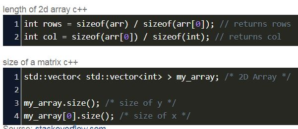
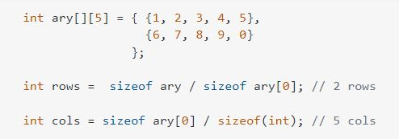
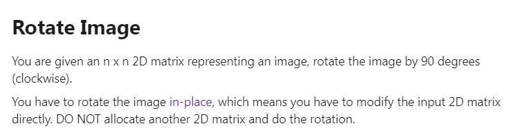

# VECTOR

* Vectors are sequence containers representing arrays that can change in size.
* Just like arrays, vectors use contiguous storage location for their elements, which means that their elements can also be accessed directly in O[1] time.
* But unlike arrays, their size can change dynamically, with their storage being handled automatically by the container.
* Push_back method has a time complexity of O[1] but in some cases it is O[n].
* Whenever a new element is added to the vector class and if the size of the vector is already filled than the size of the vectors grows by double of its size.

```C++
#include<iostream>
#include<vector>
using namespace std;
int main()
{
    //Demo vector
    vector<int> arr = {1,2,3,4};
    //size of vector
    cout<<arr.size()<<endl; 
    //capacity
    cout<<arr.capacity()<<endl;
    //push_back
    arr.push_back(13);
    int n = arr[1];
    cout<<n<<endl;
    //pop_back
    arr.pop_back();
    //fill constructor
    vector<int> arr(10,0);
    return 0;
}
```

## 2-D VECTOR

```C++
#include<iostream>
#include<vector>
using namespace std;
int main()
{
    vector<vector<int>> arr = {{1,2,3},{4,5,6},{7,8,9,10},{11,12}};
    for (int i = 0; i < arr.size(); i++)
    {
        for (int number : arr[i])
        {
            cout<<number<<","'
        }
        cout<<endl;
    }
    
    return 0;
}
```

## VECTOR CLASS

### HEADER FILE "VECTOR.h"

```C++
template<typename T>
class Vector{
    private : 
            T *arr;
            int cs;
            int ms;
    public : 
            Vector(int max = 1){
                cs = 0;
                ms = max;
                arr = new T[ms];
            }
            void push_back(const T d){
                //two cases
                if(cs==ms){
                    //create new array and delete the old array, double the capacity
                    T *oldarr = arr;
                    ms = 2*ms;
                    arr = new T[ms];
                    //copy the elements
                    for(int i = 0;i < cs;i++){
                        arr[i] = oldarr[i];
                    }
                    //delete
                    delete [] oldarr;
                }
                arr[cs] = d;
                cs++;
            }
            void pop_back(){
                if(cs>0){
                    cs--;
                }
            }
            //front,back,at(i),[]
            T front() const{
                return arr[0];
            }
            T back() const{
                return arr[cs-1];
            }
            T at(const int i) const{
                return arr[i];
            }
            int size() const{
                return cs;
            }
            int capacity() const{
                return ms;
            }
            T operator[](const int i) const{
                return arr[i];
            }
};
```

```C++
#include<iostream>
#include "vector.h"
using namespace std;


int main()
{
    Vector<char> vc;
    vc.push_back('a');
    vc.push_back('b');
    for(int i=0;i<vc.size();i++){
        cout<<vc[i];
    }

    Vector<int> v;
    v.push_back(1);
    v.push_back(2);
    v.push_back(3);
    v.push_back(4);
    v.push_back(5);
    int size = v.size();   
    int capacity = v.capacity();
    cout<<size<<" "<<capacity<<endl;
    for(int i=0;i<v.size();i++){
        cout<<v[i]<<",";
    }
    return 0;
}
```

## VECTOR SEARCH

### FIND METHOD

Time complexity of find method is O[n].

```C++
#include<iostream>
#include<algorithm>
#include<vector>
using namespace std;

int main()
{
    vector<int> arr = {10,11,2,3,4,6,7,8};
    int key;
    cin>>key;
    vector<int>::iterator it = find(arr.begin(),arr.end(),key);
    if(it!=arr.end()){
        cout<<"Present at index"<<it - arr.begin()<<endl;
    }
    else{
        cout<<"Element not found"<<endl;
    }
    return 0;
}
```

### BINARY SEARCH

* Test if value exists in sorted sequence.
* Returns true if any element in the range [first,last) is equivalent to val, and false otherwise.
* time complexity = O[log(n)].

```C++
#include <iostream>
#include <algorithm>
#include <vector>

bool myfunction (int i,int j) {     
     return (i<j); 
}

int main () {
    int myints[] = {1,2,3,4,5,4,3,2,1};
    vector<int> v(myints,myints+9);             
    sort (v.begin(), v.end());
    cout << "looking for a 3... ";
    if (binary_search (v.begin(), v.end(), 3))
    cout << "found!\n"; 
    else 
    cout << "not found.\n";
    sort (v.begin(), v.end(), myfunction);
    cout << "looking for a 6... ";
    if (binary_search (v.begin(), v.end(), 6, myfunction))
    cout << "found!\n"; 
    else 
    cout << "not found.\n";
  return 0;
}
```

### SEARCH METHOD

* Searches the range [first1,last1) for the first occurrence of the sequence defined by [first2,last2), and returns an iterator to its first element, or last1 if no occurrences are found.
* Its time complexity is O[n].

```C++
#include <iostream>   
#include <algorithm>  
#include <vector>       

bool mypredicate (int i, int j) {
    return (i==j);
}

int main () {
    vector<int> haystack;
    for (int i=1; i<10; i++) haystack.push_back(i*10);
    // using default comparison:
    int needle1[] = {40,50,60,70};
    vector<int>::iterator it;
    it = search (haystack.begin(), haystack.end(), needle1, needle1+4);
    if (it!=haystack.end())
    cout << "needle1 found at position " << (it-haystack.begin()) << '\n';
    else
    cout << "needle1 not found\n";
    // using predicate comparison:
    int needle2[] = {20,30,50};
    it = search (haystack.begin(), haystack.end(), needle2, needle2+3, mypredicate);
    if (it!=haystack.end())
    cout << "needle2 found at position " << (it-haystack.begin()) << '\n';
    else
    cout << "needle2 not found\n";
    return 0;
}
```

### UPPER BOUND

* Returns an iterator pointing to the first element in the range [first,last) which compares greater than val.
* Time complexity = O[log(n)].

```C++
#include <iostream>     
#include <algorithm>    
#include <vector>       

int main () {
    int myints[] = {10,20,30,30,20,10,10,20};
    vector<int> v(myints,myints+8);          
    sort (v.begin(), v.end());                
    vector<int>::iterator low,up;
    low = lower_bound (v.begin(), v.end(), 20); 
    up = upper_bound (v.begin(), v.end(), 20); 
    cout << "lower_bound at position " << (low- v.begin()) << '\n';
    cout << "upper_bound at position " << (up - v.begin()) << '\n';
    return 0;
}
```

### LOWER BOUND

* Returns an iterator pointing to the first element in the range [first,last) which does not compare less than val.
* Time complexity = O[log(n)].

```C++
#include <iostream>     
#include <algorithm>    
#include <vector>       

int main () {
    int myints[] = {10,20,30,30,20,10,10,20};
    vector<int> v(myints,myints+8);           
    sort (v.begin(), v.end());                
    vector<int>::iterator low,up;
    low = lower_bound (v.begin(), v.end(), 20); 
    up = upper_bound (v.begin(), v.end(), 20); 
    cout << "lower_bound at position " << (low- v.begin()) << '\n';
    cout << "upper_bound at position " << (up - v.begin()) << '\n';
    return 0;
}
```

## SORTING A VECTOR

* Sorts the elements in the range [first,last) into ascending order.
* Time complexity = O[n*log(n)].

```C++
#include<iostream>
#include<algorithm>
#include<vector>
using namespace std;

int calculatemarks(vector<int> marks){
    return marks[0] + marks[1] + marks[2];
}

bool compare(pair<string,vector<int>> s1,pair<string,vector<int>> s2){
    vector<int> m1 = s1.second;
    vector<int> m2 = s2.second;
    return calculatemarks(m1) > calculatemarks(m2);
}

int main()
{
    vector<pair<string,vector<int>>> student_marks = {
        {"rohan",{10,20,11}},
        {"prateek",{10,21,3}},
        {"vivek",{4,5,6}},
        {"rijul",{10,13,20}}
    };
    sort(student_marks.begin(),student_marks.end(),compare);
    for(auto s : student_marks){
        cout<<s.first<<" "<<calculatemarks(s.second)<<endl;
    }
    return 0;
}
```

## PROBLEM-1(ROTATING IMAGE)







```C++
#include<bits/stdc++.h>
using namespace std;
 
void transpose(vector<vector<int>>& matrix)
{
    for(int i=0; i<matrix.size(); i++)
    {
        for(int j=0;j<i;j++)
        {
            swap(matrix[i][j],matrix[j][i]);
        }
    }
}
 
void rotate(vector<vector<int>>& matrix) {
      // your code goes here
      transpose(matrix);
      int row  = matrix.size();
      int col = matrix[0].size();
      for(int i=0,j=col-1; i<j; i++,j--)
      {
          int p=0;
          for(;p<row;p++)
          {
              swap(matrix[p][i],matrix[p][j]);
          }
      }
      
}
 
int main()
{
    vector<vector<int>> matrix ={
        {1,2,3},
        {4,5,6},
        {7,8,9}
    };
    for(int i=0; i<matrix.size(); i++)
    {
        for(int number: matrix[i])
        {
            cout<<number<<" ";
        }
        cout<<endl;
    }
    rotate(matrix);
    for(int i=0; i<matrix.size(); i++)
    {
        for(int number: matrix[i])
        {
            cout<<number<<" ";
        }
        cout<<endl;
    }
}
```